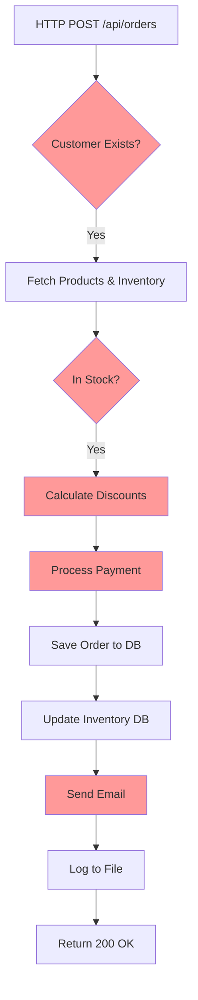
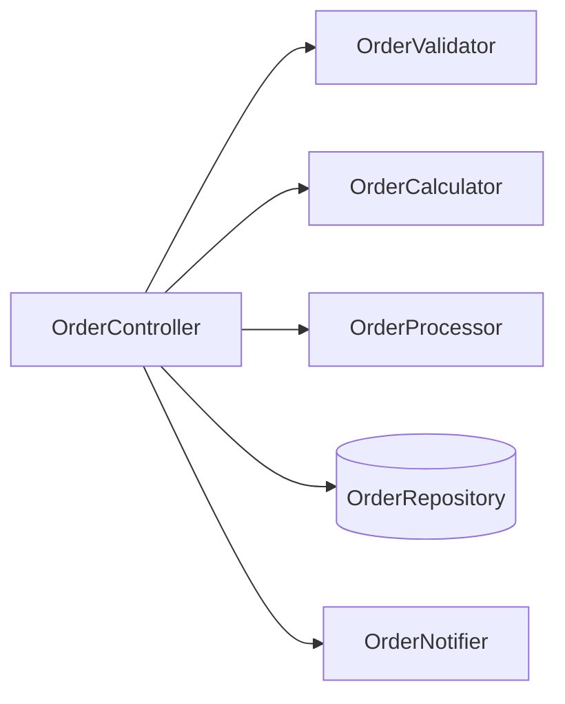
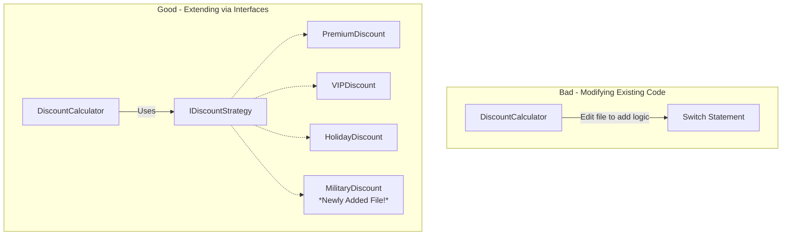
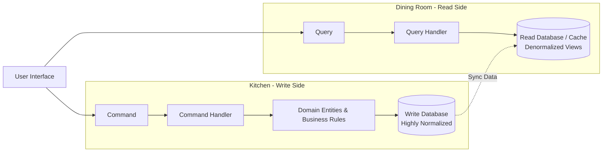
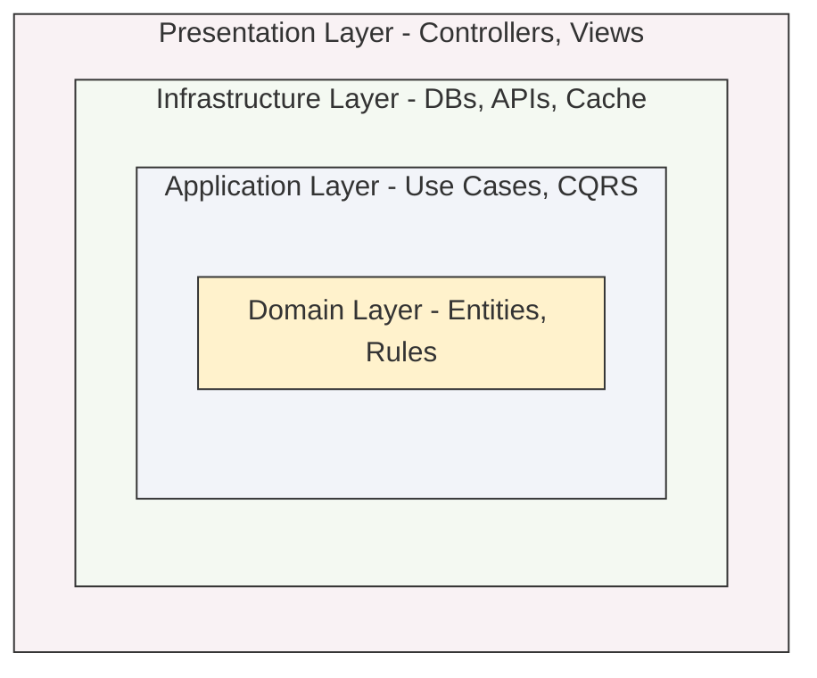

# Practical Guide with Code Examples

---

## Table of Contents

1. [Introduction](#introduction)
2. [The Problem: Unmaintainable Code](#the-problem-unmaintainable-code)
3. [SOLID Principles Explained](#solid-principles-explained)
4. [CQRS Pattern Deep Dive](#cqrs-pattern-deep-dive)
5. [Clean Architecture Layers](#clean-architecture-layers)
6. [Complete E-Commerce Implementation](#complete-e-commerce-implementation)
7. [Testing Strategies](#testing-strategies)
8. [Common Pitfalls & Solutions](#common-pitfalls--solutions)
9. [Summary & Best Practices](#summary--best-practices)

---

## Introduction

### What Are We Building?

Welcome! If you're here, you've probably felt the pain of working in a messy, fragile codebase. Today, we're going to fix that. We're building a maintainable, testable, and scalable application using three core architectural patterns:

1. **SOLID Principles** - The five foundational rules for writing clean, object-oriented code. Think of these as the basic grammar of good software.
2. **CQRS (Command Query Responsibility Segregation)** - A pattern that separates reading data from writing data. It's like having separate doors for people entering a store and people leaving.
3. **Clean Architecture** - A way of organizing your project into concentric layers, ensuring that your core business logic is never contaminated by databases or web frameworks.

### Why This Matters

Without a solid architecture, your code inevitably becomes a "Big Ball of Mud."

- ❌ **Hard to understand:** New developers take weeks to figure out how to add a simple feature.
- ❌ **Difficult to test:** You can't test business rules without spinning up a real database.
- ❌ **Expensive to change:** Touching one file breaks three others.
- ❌ **Full of bugs:** Unpredictable side effects run rampant.

With good architecture, your codebase becomes a joy to work in:

- ✅ **Easy to understand:** Every class has a clear, singular purpose.
- ✅ **Simple to test:** Business logic can be tested in milliseconds, completely isolated.
- ✅ **Cheap to change:** You can swap out a database or a UI without touching the core logic.
- ✅ **Reliable and stable:** Bugs are isolated and easy to track down.

### Who This Guide Is For

This guide is for **intermediate to senior .NET developers** who have built working applications but want to level up their architectural skills. You should be comfortable with C#, basic OOP concepts (classes, interfaces, inheritance), and ASP.NET Core fundamentals.

---

## The Problem: Unmaintainable Code

To understand why we need architecture, let's look at what happens without it. We've all seen code like this. It usually starts small, but over years of "quick fixes," it morphs into a monster.

### Example: The Spaghetti Code Nightmare

Imagine a simple endpoint to create an order. Over time, developers have stuffed validation, database queries, discount logic, payment processing, and email notifications all into one giant method.



Let's look at the actual code for this nightmare. Notice how hard it is to follow the actual business logic because it's buried under database calls and logging.

```code-morph glitch
// SYSTEM OVERLOAD - 2 Years of "Quick Fixes"
public class OrderController : Controller
{
    private readonly DbContext _db;
    private readonly IEmailSender _email;
    private readonly ILogger _log;
    private readonly ICache _cache;
    private readonly IHttpClientFactory _http;
    private readonly IConfiguration _config;
    // 10+ more dependencies...

    [HttpPost]
    public async Task<IActionResult> Create([FromBody] dynamic data)
    {
        try
        {
            // 400+ lines of spaghetti below...
            var customer = await _db.Customers
                .Include(c => c.Orders)
                .Include(c => c.Payments)
                .Include(c => c.Preferences)
                .Include(c => c.Address)
                .FirstOrDefaultAsync(c => c.Id == (int)data.customerId);

            if (customer == null)
                return NotFound("Customer not found");

            // Business logic scattered everywhere
            decimal total = 0;
            var items = new List<OrderItem>();

            foreach (var item in data.items)
            {
                var product = await _db.Products
                    .Include(p => p.Category)
                    .Include(p => p.Supplier)
                    .Include(p => p.Inventory)
                    .FirstOrDefaultAsync(p => p.Id == (int)item.productId);

                if (product == null)
                    return BadRequest($"Product {item.productId} not found");

                if (product.Stock < (int)item.quantity)
                    return BadRequest($"No stock for {product.Name}");

                // Discount logic
                decimal price = product.Price;
                if (customer.IsPremium)
                {
                    price *= 0.9m;
                    if (product.Category.Name == "Electronics")
                        price *= 0.95m;
                    if (customer.Orders.Count > 10)
                        price *= 0.98m;
                }

                if (DateTime.Now.Month == 12)
                    price *= 0.92m;

                if (product.IsClearance)
                    price *= 0.7m;

                total += price * (int)item.quantity;

                // Update stock
                product.Stock -= (int)item.quantity;
                _db.Products.Update(product);

                items.Add(new OrderItem
                {
                    ProductId = product.Id,
                    Quantity = (int)item.quantity,
                    UnitPrice = price
                });
            }

            // Create order
            var order = new Order
            {
                CustomerId = customer.Id,
                OrderNumber = $"ORD-{DateTime.Now:yyyyMMdd}-{Guid.NewGuid():N}"[..12],
                OrderDate = DateTime.Now,
                TotalAmount = total,
                Status = "Pending",
                Items = items
            };

            // Payment processing
            var payment = await ProcessPayment(order, data.payment);
            if (!payment.Success)
                return BadRequest("Payment failed");

            // Save
            _db.Orders.Add(order);
            await _db.SaveChangesAsync();

            // Side effects
            await _email.SendAsync(customer.Email, "Order Confirmation", $"Order {order.OrderNumber}");
            _log.LogInformation("Order created: {OrderNumber}", order.OrderNumber);
            await _cache.RemoveAsync($"orders_{customer.Id}");

            // External API
            var response = await _http.CreateClient().PostAsync("https://analytics.com/track",
                new StringContent(JsonSerializer.Serialize(order)));

            // File operations
            await System.IO.File.WriteAllTextAsync($"orders/{order.Id}.json", JsonSerializer.Serialize(order));

            return Ok(order);
        }
        catch (Exception ex)
        {
            _log.LogError(ex, "Failed to create order");
            return StatusCode(500, "An error occurred");
        }
    }
}
```

```codehike
// Let's break down exactly why this code is so bad.

// !border(red)
[HttpPost]
public async Task<IActionResult> Create([FromBody] dynamic data)
{
    try // !callout(Wrapping everything in a generic try-catch hides specific errors)
    {
        // 400+ lines in one method
        var customer = await _db.Customers // !bg(yellow)
            .Include(c => c.Orders)
            .Include(c => c.Payments)
            .FirstOrDefaultAsync(c => c.Id == (int)data.customerId);

        // !callout(Core business logic (discounts) is mixed directly with the HTTP handler)
        decimal price = product.Price;
        if (customer.IsPremium)
            price *= 0.9m;

        // !callout(Directly modifying the database context inside the controller)
        product.Stock -= (int)item.quantity;
        _db.Products.Update(product);

        // !tooltip(Payment processing should definitely be its own dedicated service)
        var payment = await ProcessPayment(order, data.payment);

        // !footnote(Email sending and logging are side effects that slow down the HTTP response)
        await _email.SendAsync(customer.Email, "Order Confirmation", $"Order {order.OrderNumber}");
        _log.LogInformation("Order created: {OrderNumber}", order.OrderNumber);
    }
    catch (Exception ex) // !label[10:15](Generic catch all - very bad practice)
    {
        _log.LogError(ex, "Failed to create order");
        return StatusCode(500);
    }
}
```

**This code is a nightmare because:**

- ❌ **Massive Methods:** 400+ lines in one method makes it impossible to read.
- ❌ **Mixed Concerns:** Business logic (discounts) is mixed with infrastructure (database queries).
- ❌ **Multiple Responsibilities:** The controller is doing validation, querying, calculation, saving, and emailing.
- ❌ **Hard to Test:** You cannot test the discount logic without setting up an entire database and HTTP context.
- ❌ **Fragile:** Changing the email provider might accidentally break the discount calculation.

### How Bad Code Grows Over Time

```code-morph scroll:5
// Year 1: Innocent beginnings — a simple endpoint with just enough logic
public class OrderController : Controller
{
    [HttpPost]
    public async Task<IActionResult> Create(int customerId, List<OrderItemDto> items)
    {
        // Simple. Clean. Under 20 lines.
        var customer = await _db.Customers.FindAsync(customerId);
        var order = new Order { CustomerId = customerId, Total = items.Sum(i => i.Price * i.Quantity) };
        _db.Orders.Add(order);
        await _db.SaveChangesAsync();
        return Ok(order);
    }
}
---
// Year 2: "Just add a quick discount check..."
public class OrderController : Controller
{
    [HttpPost]
    public async Task<IActionResult> Create(int customerId, List<OrderItemDto> items, string couponCode)
    {
        var customer = await _db.Customers.Include(c => c.Orders).FirstOrDefaultAsync(c => c.Id == customerId);
        // Scattered discount logic
        decimal discount = 0;
        if (couponCode == "WELCOME10") discount = 0.10m;
        if (customer.Orders.Count == 0 && couponCode == "NEWUSER") discount = 0.15m;
        // Already 50 lines...
    }
}
---
// Year 3: "We need payment processing, email, inventory tracking..."
// The controller is now a 400-line monster nobody dares to refactor.
```

### The Solution: Clean Architecture & SOLID

We fix this by dividing the massive method into small, focused classes. Each class does exactly one thing.



```code-morph explode
// Instead of one giant controller, we break it into specialized tools.
// Each class has ONE job.

public class OrderValidator
{
    public ValidationResult Validate(OrderDto dto) { }
}

public class OrderCalculator
{
    public decimal CalculateTotal(OrderDto dto) { }
}

public class OrderRepository
{
    public async Task Save(Order order) { }
}

public class OrderNotifier
{
    public async Task SendConfirmation(Order order) { }
}

public class OrderLogger
{
    public void LogCreation(Order order) { }
}

public class OrderProcessor
{
    public async Task ProcessPayment(Order order) { }
}

public class OrderAnalytics
{
    public async Task TrackOrder(Order order) { }
}
```

---

## SOLID Principles Explained

Let's dive into the five principles that make code like the refactored example above possible. We'll use simple analogies to make them click.

### S - Single Responsibility Principle (SRP)

**A class should have only one reason to change.**

_Analogy:_ Think of a Swiss Army Knife. It has a knife, a screwdriver, a corkscrew, and scissors. It's handy, but if the scissors break, you have to replace the whole tool. In programming, we don't want Swiss Army Knives. We want a dedicated, high-quality chef's knife for cutting, and a dedicated screwdriver for screws.

Let's look at how we transform a "Swiss Army" class into focused classes.

```code-morph fade
// BEFORE: One class does everything (The Swiss Army Knife)
public class OrderService
{
    public void ProcessOrder(OrderDto dto)
    {
        // Validate
        if (string.IsNullOrEmpty(dto.CustomerName))
            throw new Exception("Customer required");

        if (!dto.Items.Any())
            throw new Exception("Items required");

        // Calculate
        decimal total = 0;
        foreach(var item in dto.Items)
            total += item.Price * item.Quantity;

        // Apply discounts
        if (dto.CustomerType == "Premium")
            total *= 0.9m;

        // Save to database
        var order = new Order
        {
            CustomerName = dto.CustomerName,
            Total = total,
            CreatedAt = DateTime.UtcNow,
            Items = dto.Items
        };
        _context.Orders.Add(order);
        _context.SaveChanges();

        // Send email
        var email = new MailMessage();
        email.To.Add(dto.CustomerEmail);
        email.Subject = "Order Confirmation";
        email.Body = $"Your order #{order.Id}";
        _smtp.Send(email);
    }
}
---
// AFTER: Each class has ONE job (Dedicated Tools)
public class OrderValidator
{
    public ValidationResult Validate(OrderDto dto)
    {
        var errors = new List<string>();

        if (string.IsNullOrEmpty(dto.CustomerName))
            errors.Add("Customer required");

        if (!dto.Items.Any())
            errors.Add("Items required");

        return new ValidationResult(errors);
    }
}

public class OrderCalculator
{
    public decimal CalculateTotal(OrderDto dto)
    {
        var total = dto.Items.Sum(i => i.Price * i.Quantity);

        if (dto.CustomerType == "Premium")
            total *= 0.9m;

        return total;
    }
}

public class OrderRepository
{
    public async Task<int> Save(Order order)
    {
        _context.Orders.Add(order);
        await _context.SaveChangesAsync();
        return order.Id;
    }
}

public class OrderNotifier
{
    public async Task SendConfirmation(Order order, string email)
    {
        var message = new MailMessage();
        message.To.Add(email);
        message.Subject = "Order Confirmation";
        message.Body = $"Your order #{order.Id}";
        await _smtp.SendAsync(message);
    }
}
```

```codehike
// Let's break down the single responsibilities.

// !border(start)
// 1. OrderValidator - Its ONLY job is to check if data is valid.
public class OrderValidator // !mark(green)
{
    public ValidationResult Validate(OrderDto dto)
    {
        var errors = new List<string>();

        // !callout(If validation rules change, ONLY this class changes.)
        if (string.IsNullOrEmpty(dto.CustomerName))
            errors.Add("Customer required");

        if (!dto.Items.Any())
            errors.Add("Items required");

        return new ValidationResult(errors);
    }
}
// !border(end)

// !border(start)
// 2. OrderCalculator - Its ONLY job is math.
public class OrderCalculator // !mark(blue)
{
    public decimal CalculateTotal(OrderDto dto)
    {
        var total = dto.Items.Sum(i => i.Price * i.Quantity);

        // !label[12:25](If discount rules change, ONLY this class changes.)
        if (dto.CustomerType == "Premium")
            total *= 0.9m;

        return total;
    }
}
// !border(end)

// !border(start)
// 3. OrderRepository - Its ONLY job is talking to the database.
public class OrderRepository // !mark(yellow)
{
    public async Task<int> Save(Order order)
    {
        // !callout(If we switch from SQL to MongoDB, ONLY this class changes.)
        _context.Orders.Add(order);
        await _context.SaveChangesAsync();
        return order.Id;
    }
}
// !border(end)
```

#### Identifying SRP Violations

How do you know when a class is doing too much? Look for these warning signs:

- **"And" in class names:** `OrderValidatorAndCalculatorAndRepository` — if you feel the urge to use "and" in a class name, it's doing too much.
- **Many import statements** across different namespaces (e.g., mixing `System.Data`, `System.Net.Mail`, `System.IO`).
- **Multiple distinct sets of private methods** that could logically form separate classes.
- **Constructor injection with too many dependencies** — more than 4-5 constructor parameters is a strong smell.

### O - Open/Closed Principle (OCP)

**Open for extension, closed for modification.**

_Analogy:_ Think of a video game console like a PlayStation. You don't have to open up the console with a screwdriver and solder a new chip to play a new game. You just insert a new disc (or download it). The console is _closed_ for modification (you don't break it open), but _open_ for extension (you can play infinite new games).

In code, this usually means using Interfaces. If you want to add a new feature, you shouldn't have to edit a massive `switch` statement in existing code. You should just create a new class that implements an interface.



```code-morph flip
// BEFORE: Adding a new discount requires opening this file and modifying existing code.
// This is risky because you might accidentally break the "Premium" logic while adding "Military".
public class DiscountCalculator
{
    public decimal Calculate(decimal amount, string type)
    {
        switch(type)
        {
            case "Premium": return amount * 0.9m;
            case "VIP": return amount * 0.8m;
            case "Holiday": return amount * 0.85m;
            case "Clearance": return amount * 0.7m;
            case "Student": return amount * 0.88m;
            // Each new type requires modifying this method!
        }
    }
}
---
// AFTER: Extend without modifying existing code using Strategies.
// We define a generic "Slot" (Interface) that any discount "Cartridge" can plug into.
public interface IDiscountStrategy
{
    decimal Apply(decimal amount);
}

// We create separate, isolated classes for each discount.
public class PremiumDiscount : IDiscountStrategy
{
    public decimal Apply(decimal amount) => amount * 0.9m;
}

public class HolidayDiscount : IDiscountStrategy
{
    public decimal Apply(decimal amount) => amount * 0.85m;
}

// To add a new discount, we just create a NEW file. We don't touch the existing ones!
public class MilitaryDiscount : IDiscountStrategy
{
    public decimal Apply(decimal amount) => amount * 0.85m;
}

// The calculator just loops through whatever strategies are provided to it.
public class DiscountCalculator
{
    private readonly IEnumerable<IDiscountStrategy> _strategies;

    public DiscountCalculator(IEnumerable<IDiscountStrategy> strategies)
    {
        _strategies = strategies;
    }

    public decimal Calculate(decimal amount)
    {
        foreach(var strategy in _strategies)
            amount = strategy.Apply(amount);
        return amount;
    }
}
```

```codehike slideshow
// Walk through how OCP protects your code from bugs when adding features.

// Step 1: Define the abstraction (The game console slot)
public interface IDiscountStrategy // !mark(green)
{
    decimal Apply(decimal amount);
}
// ---
// Step 2: Implement different strategies (The game cartridges)
public class PremiumDiscount : IDiscountStrategy
{
    public decimal Apply(decimal amount) => amount * 0.9m; // !callout(10% discount)
}

public class VIPDiscount : IDiscountStrategy
{
    public decimal Apply(decimal amount) => amount * 0.8m; // !callout(20% discount)
}

public class HolidayDiscount : IDiscountStrategy
{
    public decimal Apply(decimal amount) => amount * 0.85m; // !tooltip(Holiday season)
}
// ---
// Step 3: Add new strategy WITHOUT modifying ANY existing code
public class StudentDiscount : IDiscountStrategy
{
    public decimal Apply(decimal amount) => amount * 0.88m; // !callout(12% student discount)
}

// !callout(We just added this feature safely by creating a new file!)
public class MilitaryDiscount : IDiscountStrategy
{
    public decimal Apply(decimal amount) => amount * 0.85m; // !callout(15% military discount)
}
// ---
// Step 4: The Calculator never needs to change again. It's Closed for Modification.
public class DiscountCalculator
{
    private readonly IEnumerable<IDiscountStrategy> _strategies;

    public decimal Calculate(decimal amount)
    {
        foreach(var strategy in _strategies)
            amount = strategy.Apply(amount); // !mark(green)
        return amount;
    }
}
```

#### Real-World OCP: Validation Pipelines

A practical pattern you'll see in many production systems is using OCP for validation. Instead of one giant `Validate()` method with 50 checks, you build a pipeline of validators:

```csharp
public interface IValidator<T>
{
    ValidationResult Validate(T entity);
}

public class OrderMustHaveItemsValidator : IValidator<Order>
{
    public ValidationResult Validate(Order order)
    {
        if (!order.Items.Any())
            return ValidationResult.Error("Order must have at least one item");
        return ValidationResult.Success();
    }
}

public class OrderCustomerMustExistValidator : IValidator<Order>
{
    private readonly ICustomerRepository _customerRepo;

    public OrderCustomerMustExistValidator(ICustomerRepository customerRepo)
    {
        _customerRepo = customerRepo;
    }

    public ValidationResult Validate(Order order)
    {
        var exists = _customerRepo.Exists(order.CustomerId);
        if (!exists)
            return ValidationResult.Error("Customer does not exist");
        return ValidationResult.Success();
    }
}

// The pipeline runner never changes — you just add new validators
public class ValidationPipeline<T>
{
    private readonly IEnumerable<IValidator<T>> _validators;

    public ValidationPipeline(IEnumerable<IValidator<T>> validators)
    {
        _validators = validators;
    }

    public async Task<ValidationResult> Execute(T entity)
    {
        foreach (var validator in _validators)
        {
            var result = validator.Validate(entity);
            if (!result.IsValid)
                return result;
        }
        return ValidationResult.Success();
    }
}
```

### L - Liskov Substitution Principle (LSP)

**Subtypes must be substitutable for their base types without breaking things.**

_Analogy:_ If it looks like a duck, quacks like a duck, but needs batteries... you probably have the wrong abstraction. If you have a base class `Bird` with a `Fly()` method, an `Ostrich` class shouldn't inherit from it because an Ostrich can't fly. If code expects any `Bird` to be able to `Fly()`, passing it an `Ostrich` will crash your program.

The classic example in programming is the Rectangle/Square problem.

```code-morph diff
// BEFORE: Violates LSP. A Square is mathematically a Rectangle, but in behavior, it's not.
public class Rectangle
{
    public virtual double Width { get; set; }
    public virtual double Height { get; set; }
    public double Area() => Width * Height;
}

public class Square : Rectangle
{
    private double _side;

    // In a square, width and height must be identical.
    public override double Width
    {
        get => _side;
        set { _side = value; } // Changing width secretly changes height!
    }

    public override double Height
    {
        get => _side;
        set { _side = value; } // Changing height secretly changes width!
    }

    // This breaks down completely if we expect normal Rectangle behavior.
}

void Test(Rectangle rect)
{
    rect.Width = 5;
    rect.Height = 10;
    // We expect area to be 50. But if we passed in a Square, the area would be 100!
}
---
// AFTER: Proper abstraction. Don't force inheritance where behavior differs.
public interface IShape
{
    double Area();
}

public class Rectangle : IShape
{
    public double Width { get; set; }
    public double Height { get; set; }
    public double Area() => Width * Height;
}

public class Square : IShape
{
    public double Side { get; set; }
    public double Area() => Side * Side;
}

// Works correctly - each shape behaves independently according to its own rules.
void Test(IShape shape)
{
    // Now we only care about what they CAN do (calculate area), not what they ARE.
    var area = shape.Area();
}
```

#### LSP in Practice: Stream Example

A more realistic .NET example is violating LSP with streams. Never return a `MemoryStream` when the contract says `Stream` if the caller might rely on `CanSeek`, `CanWrite`, or `Length`:

```csharp
// BAD: Callers expect a writable stream, but you return a read-only one
public Stream GenerateReport()
{
    var memoryStream = new MemoryStream();
    // ... write report ...
    memoryStream.Position = 0;
    return memoryStream; // OK — MemoryStream supports everything
}

// WORSE: Returning a CryptoStream when caller might try to seek
public Stream DecryptData(byte[] data)
{
    var encryptedStream = new MemoryStream(data);
    var decrypted = new CryptoStream(encryptedStream, ...);
    // BUT: CryptoStream does NOT support seeking!
    return decrypted; // LSP violation if caller expects seekable stream
}
```

**The fix:** Be explicit in your interface about what capabilities are expected. Use `CanSeek`, `CanWrite`, or define narrower abstractions.

### I - Interface Segregation Principle (ISP)

**Don't force clients to depend on methods they don't use.**

_Analogy:_ Imagine buying a standard TV remote, but it also has buttons for a microwave, a garage door, and a sprinkler system. It's confusing, cluttered, and unnecessary. Interfaces should be small and specific, like a dedicated remote for just the TV.

```code-morph blur
// BEFORE: Fat interface - Everyone is forced to implement everything.
// This is like the remote control with 100 confusing buttons.
public interface IOrderService
{
    void CreateOrder(OrderDto dto);
    void UpdateOrder(OrderDto dto);
    void DeleteOrder(int id);
    OrderDto GetOrder(int id);
    List<OrderDto> ListOrders();
    void SendConfirmation(int id);
    void PrintInvoice(int id);
    void ProcessPayment(int id);
    void TrackShipment(int id);
    void ApplyDiscount(OrderDto dto);
    void CalculateTax(OrderDto dto);
    void GenerateReport(int id);
    void ExportData(int id, string format);
}
---
// AFTER: Segregated interfaces - Only what's needed.
// Break the massive interface into tiny, focused interfaces based on capabilities.
public interface IOrderWriter
{
    void CreateOrder(OrderDto dto);
    void UpdateOrder(OrderDto dto);
    void DeleteOrder(int id);
}

public interface IOrderReader
{
    OrderDto GetOrder(int id);
    List<OrderDto> ListOrders();
}

public interface IOrderNotifier
{
    void SendConfirmation(int id);
    void PrintInvoice(int id);
}

public interface IOrderProcessor
{
    void ProcessPayment(int id);
    void TrackShipment(int id);
}

public interface IOrderCalculator
{
    void ApplyDiscount(OrderDto dto);
    void CalculateTax(OrderDto dto);
}

public interface IOrderExporter
{
    void GenerateReport(int id);
    void ExportData(int id, string format);
}

// Clients only implement what they specifically need. No dead code!
public class OrderAdminService : IOrderWriter, IOrderReader
{
    // Only needs writing and reading
}

public class OrderCustomerService : IOrderReader, IOrderNotifier
{
    // Only needs reading and notifications
}

public class OrderReportingService : IOrderReader, IOrderExporter
{
    // Only needs reading and exporting
}
```

#### The ISP Smell Test

If you find yourself throwing `NotSupportedException` or leaving methods empty (`{ }`), you likely have an ISP violation. Delete those methods and split the interface.

### D - Dependency Inversion Principle (DIP)

**Depend on abstractions (interfaces), not concretions (actual classes).**

_Analogy:_ When you plug a lamp into a wall, the lamp doesn't care if the electricity is coming from a coal plant, a solar farm, or a hamster on a wheel. It just depends on the standard "Interface" of the electrical outlet.

In code, your business logic shouldn't care if data is saved in SQL Server, MongoDB, or a text file. It should just depend on an interface (like `IOrderRepository`).

```code-morph zoom
// BEFORE: Tight coupling to concrete implementations
// The OrderService is "hardwired" to SQL and SMTP. You can't easily swap them out.
public class OrderService
{
    // Hardcoded dependencies. Very hard to test!
    private SqlDatabase _db = new SqlDatabase();
    private SmtpEmail _email = new SmtpEmail();
    private FileLogger _logger = new FileLogger();
    private RedisCache _cache = new RedisCache();

    public void ProcessOrder(OrderDto dto)
    {
        // Direct usage of concrete implementations
        _db.Save(order);
        _email.Send(confirmation);
        _logger.Log("Order processed");
        _cache.Set(order.Id, order);
    }
}
---
// AFTER: Loose coupling via abstractions
// The OrderService depends only on interfaces.
public interface IOrderRepository { Task Save(Order order); }
public interface IEmailService { Task Send(EmailMessage message); }
public interface ILogger { void Log(string message); }
public interface ICacheService { void Set(string key, object value); object Get(string key); }

public class OrderService
{
    private readonly IOrderRepository _repository;
    private readonly IEmailService _email;
    private readonly ILogger _logger;
    private readonly ICacheService _cache;

    // Dependencies are "Injected" via the constructor
    public OrderService(
        IOrderRepository repository,
        IEmailService email,
        ILogger logger,
        ICacheService cache)
    {
        _repository = repository;
        _email = email;
        _logger = logger;
        _cache = cache;
    }

    public async Task ProcessOrder(OrderDto dto)
    {
        // Using abstractions. It has no idea what database is actually being used.
        await _repository.Save(order);
        await _email.Send(confirmation);
        _logger.Log("Order processed");
        _cache.Set(order.Id.ToString(), order);
    }
}

// Concrete implementations handle the messy details
public class SqlOrderRepository : IOrderRepository
{
    private readonly SqlConnection _connection;
    public async Task Save(Order order) { /* SQL implementation */ }
}

public class SmtpEmailService : IEmailService
{
    private readonly SmtpClient _client;
    public async Task Send(EmailMessage message) { /* SMTP implementation */ }
}
```

#### Wiring It All Up: Dependency Injection

In your ASP.NET Core `Program.cs`, you register which concrete implementation to use for each abstraction:

```csharp
// Program.cs - Composition Root
builder.Services.AddScoped<IOrderRepository, SqlOrderRepository>();
builder.Services.AddScoped<IEmailService, SmtpEmailService>();
builder.Services.AddScoped<ILogger, FileLogger>();
builder.Services.AddScoped<ICacheService, RedisCacheService>();
builder.Services.AddScoped<OrderService>();

// When testing, swap out with mocks
// builder.Services.AddScoped<IOrderRepository, InMemoryOrderRepository>();
```

This is called the **Composition Root** — the only place in your application where concrete classes are wired together.

---

## CQRS Pattern Deep Dive

### What is CQRS?

**Command Query Responsibility Segregation** (CQRS) is a pattern that says: "The way we read data should be completely separate from the way we write data."

_Analogy:_ Think of a high-end restaurant. There's the **Dining Room** (The Read side), which is optimized for presentation, comfort, and speed. Then there's the **Kitchen** (The Write side), which is chaotic, strict, and optimized for processing raw ingredients (business rules). You don't want the customers sitting in the kitchen, and you don't want the chefs cooking in the dining room.



```code-morph matrix
// BEFORE: A traditional service mixes reads and writes.
// This gets messy because reading data often requires different optimizations than writing.
public class OrderService
{
    public Order GetOrder(int id) { } // Read
    public void CreateOrder(OrderDto dto) { } // Write
    public void UpdateOrder(OrderDto dto) { } // Write
    public List<Order> GetOrders() { } // Read
    public void DeleteOrder(int id) { } // Write
    public OrderDto GetOrderDetails(int id) { } // Read
}
---
// AFTER: Separated concerns using CQRS concepts.

// COMMANDS (Write/Kitchen) - Represent an INTENT to change data.
public interface ICommandHandler<TCommand>
{
    Task Handle(TCommand command);
}

// Simple data records holding the instruction.
public record CreateOrderCommand : ICommand { }
public record UpdateOrderCommand : ICommand { }
public record DeleteOrderCommand : ICommand { }

// QUERIES (Read/Dining Room) - Represent a REQUEST to view data.
public interface IQueryHandler<TQuery, TResult>
{
    Task<TResult> Handle(TQuery query);
}

// Simple data records asking for information.
public record GetOrderQuery : IQuery<OrderDto> { }
public record GetOrdersQuery : IQuery<List<OrderDto>> { }
public record GetOrderDetailsQuery : IQuery<OrderDetailsDto> { }
```

### Commands - Writes (The Kitchen)

Commands are all about strict business rules. When someone tries to buy an item, we must check inventory, validate payment, and ensure the order is legal. It's complex and strict.

```code-morph flight
// The Command represents the user's intent.
public record CreateOrderCommand : ICommand<CreateOrderResult>
{
    public int CustomerId { get; init; }
    public List<OrderItemDto> Items { get; init; }
    public string ShippingAddress { get; init; }
    public string PaymentMethod { get; init; }
}

// The Command Handler executes the strict business logic.
public class CreateOrderCommandHandler : ICommandHandler<CreateOrderCommand, CreateOrderResult>
{
    private readonly IOrderRepository _orderRepository;
    private readonly IProductRepository _productRepository;
    private readonly IUnitOfWork _unitOfWork;

    public async Task<CreateOrderResult> Handle(CreateOrderCommand command)
    {
        // 1. Fetch current state (Ingredients)
        var products = await _productRepository.GetByIdsAsync(
            command.Items.Select(i => i.ProductId));

        // 2. Enforce strict business rules (Cooking)
        ValidateStock(products, command.Items);

        // 3. Create the Domain Entity
        var order = new Order(command.CustomerId, command.Items, products);

        // 4. Save to the write database
        await _orderRepository.AddAsync(order);
        await _unitOfWork.SaveChangesAsync();

        return new CreateOrderResult(order.Id);
    }
}
```

### Queries - Reads (The Dining Room)

Queries don't care about business rules or validations. They just want data as fast as possible to display to the user. They often bypass the domain entirely and read straight from the database or cache.

```code-morph typewriter
// The Query asks for specific data.
public record GetOrderQuery : IQuery<OrderDto>
{
    public int OrderId { get; init; }
}

// The Query Handler fetches data as quickly as possible.
public class GetOrderQueryHandler : IQueryHandler<GetOrderQuery, OrderDto>
{
    private readonly IOrderReadRepository _repository;
    private readonly IMapper _mapper;
    private readonly ICacheService _cache;

    public async Task<OrderDto> Handle(GetOrderQuery query)
    {
        // 1. FAST PATH: Check the cache first (like a buffet ready to eat)
        var cacheKey = $"order_{query.OrderId}";
        var cached = await _cache.Get<OrderDto>(cacheKey);
        if (cached != null)
            return cached;

        // 2. SLOW PATH: Query database (bypassing heavy business entities)
        var order = await _repository.GetOrderDetailsAsync(query.OrderId);

        if (order == null)
            throw new NotFoundException($"Order {query.OrderId} not found");

        var dto = _mapper.Map<OrderDto>(order);

        // 3. Store in cache for the next person
        await _cache.Set(cacheKey, dto, TimeSpan.FromMinutes(5));

        return dto;
    }
}
```

### When To Use CQRS (And When NOT To)

CQRS adds complexity. Ask yourself these questions before adopting it:

**Use CQRS when:**
- Your read and write workloads have significantly different shapes (e.g., writes are complex with many business rules, reads are simple projections)
- You need different data models for reads vs. writes
- You have performance requirements that demand read optimization (caching, denormalized views, materialized tables)
- Your team is large enough that separating concerns helps multiple developers work in parallel

**Skip CQRS when:**
- You're building a simple CRUD app with no complex business logic (e.g., a contact form, a blog CMS)
- Your reads and writes are nearly identical in shape
- You don't have performance issues with reads
- Your team is small and the overhead isn't worth it

> **Rule of Thumb:** Start with a simple layered architecture. Introduce CQRS only when you feel the pain of mixed read/write concerns. Premature CQRS is just as bad as no architecture at all.

### The Mediator Pattern: Gluing CQRS Together

CQRS naturally pairs with the Mediator pattern (often implemented via the `MediatR` library in .NET). Instead of controllers directly depending on handlers, they send commands/queries through a mediator:

```csharp
[ApiController]
[Route("api/orders")]
public class OrdersController : ControllerBase
{
    private readonly IMediator _mediator;

    public OrdersController(IMediator mediator)
    {
        _mediator = mediator;
    }

    [HttpPost]
    public async Task<IActionResult> Create(CreateOrderRequest request)
    {
        var command = new CreateOrderCommand
        {
            CustomerId = request.CustomerId,
            Items = request.Items,
            ShippingAddress = request.ShippingAddress,
            PaymentMethod = request.PaymentMethod
        };

        var result = await _mediator.Send(command);
        return CreatedAtAction(nameof(Get), new { id = result.OrderId }, result);
    }

    [HttpGet("{id}")]
    public async Task<IActionResult> Get(int id)
    {
        var query = new GetOrderQuery { OrderId = id };
        var result = await _mediator.Send(query);
        return Ok(result);
    }
}
```

**Benefits of MediatR:**
- Controllers become thin — they just map HTTP to commands/queries
- Handlers are easily testable in isolation
- Cross-cutting concerns (logging, validation, transactions) can be applied via pipelines/behaviors
- Each handler is a single file with a single responsibility

---

## Clean Architecture Layers

Clean Architecture (often called Onion Architecture) organizes code in concentric circles.

The golden rule is the **Dependency Rule**: _Source code dependencies must point only inward, toward higher-level policies._



1. **Domain Layer (Center):** Your pure business rules. It doesn't know about databases, JSON, or HTTP. It just knows how your business operates.
2. **Application Layer:** Contains your Use Cases (the CQRS Commands and Queries). It orchestrates the domain objects but still doesn't talk directly to a specific database.
3. **Infrastructure Layer:** Where the dirty work happens. EF Core, SQL connections, SMTP email clients, external HTTP calls.
4. **Presentation Layer (Outer):** Web API Controllers, UI, React apps. It's just a delivery mechanism.

### Project Structure

Here's how you'd organize a real .NET solution:

```
MyECommerce.sln
├── src/
│   ├── MyECommerce.Domain/           # Inner layer - No dependencies
│   │   ├── Entities/
│   │   │   ├── Order.cs
│   │   │   ├── OrderItem.cs
│   │   │   └── Customer.cs
│   │   ├── ValueObjects/
│   │   │   ├── Money.cs
│   │   │   └── Address.cs
│   │   ├── Interfaces/
│   │   │   ├── IOrderRepository.cs
│   │   │   └── ICustomerRepository.cs
│   │   └── Services/
│   │       └── DiscountService.cs
│   │
│   ├── MyECommerce.Application/      # Depends on Domain
│   │   ├── Commands/
│   │   │   ├── CreateOrder/
│   │   │   │   ├── CreateOrderCommand.cs
│   │   │   │   └── CreateOrderCommandHandler.cs
│   │   │   └── CancelOrder/
│   │   ├── Queries/
│   │   │   ├── GetOrder/
│   │   │   └── GetOrdersByCustomer/
│   │   ├── DTOs/
│   │   │   ├── OrderDto.cs
│   │   │   └── OrderSummaryDto.cs
│   │   └── Interfaces/
│   │       ├── IOrderReadRepository.cs
│   │       └── IEmailService.cs
│   │
│   ├── MyECommerce.Infrastructure/    # Depends on Application
│   │   ├── Persistence/
│   │   │   ├── AppDbContext.cs
│   │   │   ├── Repositories/
│   │   │   └── Migrations/
│   │   ├── Email/
│   │   │   └── SmtpEmailService.cs
│   │   └── Cache/
│   │       └── RedisCacheService.cs
│   │
│   └── MyECommerce.Web/              # Depends on Infrastructure
│       ├── Controllers/
│       ├── Middleware/
│       └── Program.cs (Composition Root)
│
└── tests/
    ├── MyECommerce.Domain.Tests/
    ├── MyECommerce.Application.Tests/
    └── MyECommerce.Integration.Tests/
```

Let's see this in code:

```code-morph erase
// LAYER 4: Presentation (Outer) - Knows about HTTP, JSON, Routing
[ApiController]
[Route("api/orders")]
public class OrdersController : ControllerBase
{
    private readonly IMediator _mediator;

    [HttpPost]
    public async Task<IActionResult> Create([FromBody] CreateOrderRequest request)
    {
        var command = _mapper.Map<CreateOrderCommand>(request);
        var result = await _mediator.Send(command); // Hands off to Application Layer
        return CreatedAtAction(nameof(Get), new { id = result.OrderId }, result);
    }
}

// LAYER 3: Infrastructure - Knows about SQL, Entity Framework
public class OrderRepository : IOrderRepository
{
    private readonly AppDbContext _context;

    public async Task AddAsync(Order order)
    {
        // Translates beautiful Domain objects into messy Database tables
        var entity = MapToDbEntity(order);
        await _context.Orders.AddAsync(entity);
    }
}

// LAYER 2: Application - Knows about Use Cases (The "What")
public class CreateOrderCommandHandler : ICommandHandler<CreateOrderCommand>
{
    private readonly IOrderRepository _repository; // Interface from Domain!

    public async Task Handle(CreateOrderCommand command)
    {
        // Orchestrates the business rules
        var order = new Order(command.CustomerId, command.Items);
        await _repository.AddAsync(order);
    }
}

// LAYER 1: Domain (Inner) - Knows ONLY about Business Rules
public class Order : AggregateRoot
{
    // No SQL. No HTTP. Just pure C# logic.
    public void Confirm()
    {
        if (Status != OrderStatus.Pending)
            throw new DomainException("Cannot confirm non-pending order");
        Status = OrderStatus.Confirmed;
    }
}
```

### The Dependency Rule: What It Means in Practice

The dependency rule means:

- **Domain** has ZERO project references — it's pure C# with no NuGet packages beyond maybe a basic class library template
- **Application** references Domain ONLY — it never references Entity Framework, SQL Server, or any infrastructure library
- **Infrastructure** references Application — it implements the interfaces defined in Application/Domain
- **Presentation** references Infrastructure — it wires everything together in the Composition Root

This means if you want to swap from SQL Server to PostgreSQL:
1. You change the Infrastructure layer only
2. Domain and Application remain untouched
3. Zero business logic changes

---

## Complete E-Commerce Implementation

Let's put everything together. We're going to look at the heart of our application: The Domain Layer.

In Domain-Driven Design (DDD), an **Aggregate Root** is the main entity that controls access to its children. For us, `Order` is the Aggregate Root. You can't modify an `OrderItem` directly; you must go through the `Order`.

### The Domain Layer (The Core)

This code represents the purest form of our business. It is incredibly protective of its own state. Notice how all setters are `private`. You can only change the state of the Order by calling specific behavior methods like `Confirm()` or `Ship()`.

```code-morph highlight:3
// Domain Layer - Pure Business Logic
public class Order : AggregateRoot
{
    // PRIVATE FIELDS - Protecting our internal state
    private List<OrderItem> _items = new();

    // PUBLIC PROPERTIES - Read-only to the outside world
    public int Id { get; private set; }
    public string OrderNumber { get; private set; }
    public int CustomerId { get; private set; }
    public OrderStatus Status { get; private set; }
    public decimal TotalAmount { get; private set; }
    public IReadOnlyList<OrderItem> Items => _items.AsReadOnly();

    // FACTORY CONSTRUCTOR - Validates state upon creation
    public Order(int customerId, List<OrderItem> items, string shippingAddress)
    {
        if (customerId <= 0)
            throw new DomainException("Customer ID required");

        if (!items.Any())
            throw new DomainException("Order must have items");

        Id = GenerateId();
        CustomerId = customerId;
        _items = items;
        Status = OrderStatus.Pending;
        TotalAmount = CalculateTotal();

        // Raise a Domain Event to notify other parts of the system
        AddEvent(new OrderCreatedEvent(Id, CustomerId, TotalAmount));
    }

    // BEHAVIOR METHODS - The only way to change state
    public void Confirm()
    {
        // Enforce business rules strictly!
        if (Status != OrderStatus.Pending)
            throw new DomainException("Only pending orders can be confirmed");

        Status = OrderStatus.Confirmed;
        AddEvent(new OrderConfirmedEvent(Id));
    }

    public void Ship(string trackingNumber)
    {
        if (Status != OrderStatus.Confirmed)
            throw new DomainException("Only confirmed orders can be shipped");

        if (string.IsNullOrWhiteSpace(trackingNumber))
            throw new DomainException("Tracking number is required");

        Status = OrderStatus.Shipped;
        AddEvent(new OrderShippedEvent(Id, trackingNumber));
    }

    // Helper method
    private decimal CalculateTotal() =>
        _items.Sum(i => i.Quantity * i.UnitPrice);
}

// VALUE OBJECTS - Immutable objects defined by their properties
public class OrderItem : ValueObject
{
    public int ProductId { get; }
    public int Quantity { get; }
    public decimal UnitPrice { get; }

    public OrderItem(int productId, int quantity, decimal unitPrice)
    {
        if (quantity <= 0) throw new DomainException("Quantity must be positive");
        if (unitPrice < 0) throw new DomainException("Unit price cannot be negative");

        ProductId = productId;
        Quantity = quantity;
        UnitPrice = unitPrice;
    }
}

// ENUM - Explicit state machine
public enum OrderStatus
{
    Pending,
    Confirmed,
    Shipped,
    Delivered,
    Cancelled
}
```

```codehike
// Let's analyze why this Domain Entity is so powerful.

// !border(start)
public class Order : AggregateRoot
{
    // !mark(green)
    // !callout(Internal state is hidden. The outside world cannot mess with this list directly.)
    private List<OrderItem> _items = new();

    // !callout(Properties can be read, but only changed from INSIDE the class.)
    public string OrderNumber { get; private set; }
    public OrderStatus Status { get; private set; }
}
// !border(end)

// !border(start)
// The Constructor acts as a strict bouncer. It ensures an invalid Order can never exist in memory.
public Order(int customerId, List<OrderItem> items, string shippingAddress)
{
    // !callout(Failing fast if data is garbage)
    if (customerId <= 0)
        throw new DomainException("Customer ID required");

    if (!items.Any())
        throw new DomainException("Order must have items");

    // Initialize valid state...
}
// !border(end)

// !border(start)
// Instead of setting Status directly (e.g., order.Status = "Shipped"),
// we use expressive methods that map to real-world business actions.
public void Confirm()
{
    // !tooltip(State machine logic prevents illegal transitions!)
    if (Status != OrderStatus.Pending)
        throw new DomainException("Only pending orders can be confirmed");

    Status = OrderStatus.Confirmed;
}
// !border(end)
```

### The Application Layer: Complete Use Case

Here's what a full command handler looks like with all the plumbing:

```csharp
public class CreateOrderCommandHandler : IRequestHandler<CreateOrderCommand, Result<OrderDto>>
{
    private readonly ICustomerRepository _customerRepo;
    private readonly IProductRepository _productRepo;
    private readonly IOrderRepository _orderRepo;
    private readonly IUnitOfWork _unitOfWork;
    private readonly IMapper _mapper;
    private readonly ILogger<CreateOrderCommandHandler> _logger;

    public CreateOrderCommandHandler(
        ICustomerRepository customerRepo,
        IProductRepository productRepo,
        IOrderRepository orderRepo,
        IUnitOfWork unitOfWork,
        IMapper mapper,
        ILogger<CreateOrderCommandHandler> logger)
    {
        _customerRepo = customerRepo;
        _productRepo = productRepo;
        _orderRepo = orderRepo;
        _unitOfWork = unitOfWork;
        _mapper = mapper;
        _logger = logger;
    }

    public async Task<Result<OrderDto>> Handle(CreateOrderCommand command, CancellationToken ct)
    {
        // 1. Validate customer exists
        var customer = await _customerRepo.GetByIdAsync(command.CustomerId, ct);
        if (customer is null)
            return Result.Failure<OrderDto>("Customer not found");

        // 2. Fetch products
        var productIds = command.Items.Select(i => i.ProductId).ToList();
        var products = await _productRepo.GetByIdsAsync(productIds, ct);

        // 3. Check stock
        foreach (var item in command.Items)
        {
            var product = products.FirstOrDefault(p => p.Id == item.ProductId);
            if (product is null)
                return Result.Failure<OrderDto>($"Product {item.ProductId} not found");
            if (product.StockQuantity < item.Quantity)
                return Result.Failure<OrderDto>($"Insufficient stock for product {product.Name}");
        }

        // 4. Create domain entity
        var orderItems = command.Items.Select(i =>
            new OrderItem(i.ProductId, i.Quantity, products.First(p => p.Id == i.ProductId).UnitPrice)
        ).ToList();

        var order = new Order(command.CustomerId, orderItems, command.ShippingAddress);

        // 5. Persist
        await _orderRepo.AddAsync(order, ct);
        await _unitOfWork.SaveChangesAsync(ct);

        _logger.LogInformation("Order {OrderId} created for customer {CustomerId}",
            order.Id, command.CustomerId);

        // 6. Return result
        return Result.Success(_mapper.Map<OrderDto>(order));
    }
}
```

### Domain Events: Decoupling Side Effects

Instead of sending emails directly inside a command handler, we raise domain events and have separate event handlers respond to them:

```csharp
// Domain event
public record OrderCreatedEvent(int OrderId, int CustomerId, decimal TotalAmount) : IDomainEvent;

// Event handler in the Application layer
public class OrderCreatedEventHandler : INotificationHandler<OrderCreatedEvent>
{
    private readonly IEmailService _emailService;
    private readonly IOrderRepository _orderRepo;

    public async Task Handle(OrderCreatedEvent notification, CancellationToken ct)
    {
        var order = await _orderRepo.GetByIdAsync(notification.OrderId, ct);
        var customer = order?.Customer;

        if (customer is not null)
        {
            await _emailService.SendOrderConfirmationAsync(
                customer.Email,
                order!.OrderNumber,
                ct
            );
        }
    }
}

// Another handler for the same event - completely decoupled
public class OrderCreatedAnalyticsHandler : INotificationHandler<OrderCreatedEvent>
{
    private readonly IAnalyticsService _analytics;

    public async Task Handle(OrderCreatedEvent notification, CancellationToken ct)
    {
        await _analytics.TrackEventAsync("order_created", new
        {
            OrderId = notification.OrderId,
            CustomerId = notification.CustomerId,
            Amount = notification.TotalAmount
        }, ct);
    }
}
```

---

## Testing Strategies

Because we separated everything, testing is incredibly easy. We don't need a database to test our Domain logic.

### 1. Unit Testing the Domain

Domain tests are blazing fast because they only rely on pure C# objects.

```csharp
public class OrderTests
{
    [Fact]
    public void ConfirmOrder_WhenPending_ShouldSucceed()
    {
        // Arrange
        var items = new List<OrderItem> { new OrderItem(1, 1, 10.00m) };
        var order = new Order(123, items, "123 Main St"); // Starts as Pending

        // Act
        order.Confirm();

        // Assert
        Assert.Equal(OrderStatus.Confirmed, order.Status);
    }

    [Fact]
    public void ConfirmOrder_WhenAlreadyConfirmed_ShouldThrowException()
    {
        // Arrange
        var items = new List<OrderItem> { new OrderItem(1, 1, 10.00m) };
        var order = new Order(123, items, "123 Main St");
        order.Confirm(); // Confirm it once

        // Act & Assert
        // Trying to confirm again should trigger our business rule exception
        Assert.Throws<DomainException>(() => order.Confirm());
    }
}
```

### 2. Unit Testing Application Handlers (Use Cases)

We can use mocking frameworks (like Moq, NSubstitute, or FakeItEasy) to pretend to be the database.

```csharp
public class CreateOrderCommandHandlerTests
{
    [Fact]
    public async Task Handle_WithValidCommand_ShouldSaveOrder()
    {
        // Arrange - Mock our interfaces!
        var mockRepository = new Mock<IOrderRepository>();
        var mockUnitOfWork = new Mock<IUnitOfWork>();

        var handler = new CreateOrderCommandHandler(
            mockRepository.Object,
            mockUnitOfWork.Object
        );

        var command = new CreateOrderCommand { CustomerId = 1, /* ... */ };

        // Act
        var result = await handler.Handle(command, CancellationToken.None);

        // Assert - Verify the handler actually tried to save the order!
        mockRepository.Verify(x => x.AddAsync(It.IsAny<Order>(), It.IsAny<CancellationToken>()), Times.Once);
        mockUnitOfWork.Verify(x => x.SaveChangesAsync(It.IsAny<CancellationToken>()), Times.Once);
    }
}
```

### 3. Integration Testing: Test the Real Stack

While unit tests verify individual pieces, integration tests verify that the whole system works together:

```csharp
public class OrderIntegrationTests : IClassFixture<WebApplicationFactory<Program>>
{
    private readonly WebApplicationFactory<Program> _factory;
    private readonly HttpClient _client;

    public OrderIntegrationTests(WebApplicationFactory<Program> factory)
    {
        _factory = factory.WithWebHostBuilder(builder =>
        {
            builder.ConfigureServices(services =>
            {
                // Replace real database with in-memory for testing
                services.RemoveAll<DbContextOptions<AppDbContext>>();
                services.AddDbContext<AppDbContext>(options =>
                    options.UseInMemoryDatabase("TestDb"));
            });
        });
        _client = _factory.CreateClient();
    }

    [Fact]
    public async Task CreateOrder_WithValidData_Returns201()
    {
        // Arrange
        var request = new CreateOrderRequest
        {
            CustomerId = 1,
            Items = new[] { new OrderItemDto { ProductId = 1, Quantity = 2 } },
            ShippingAddress = "123 Test St"
        };

        // Act
        var response = await _client.PostAsJsonAsync("/api/orders", request);

        // Assert
        Assert.Equal(HttpStatusCode.Created, response.StatusCode);
    }
}
```

---

## Common Pitfalls & Solutions

1. **Over-engineering simple CRUD apps:**
   - _Pitfall:_ Using full Clean Architecture and CQRS for a simple "Contact Us" form.
   - _Solution:_ Keep it simple. If there is no complex business logic, a simple controller talking to EF Core is perfectly fine. Save Clean Architecture for your complex, core business domains.

2. **Leaking Domain Entities to the UI:**
   - _Pitfall:_ Returning your `Order` aggregate directly from the API. This exposes internal details and couples your UI to your database.
   - _Solution:_ Always map Domain entities to DTOs (Data Transfer Objects) in the Application layer before returning them.

3. **Anemic Domain Models:**
   - _Pitfall:_ Having Domain entities that are just bags of getters and setters with no logic, putting all the `if/else` logic in the Application Services.
   - _Solution:_ Move business rules (validations, calculations, state changes) directly into the Domain entities themselves.

4. **Circular Dependencies:**
   - _Pitfall:_ Domain referencing Infrastructure, creating a circular reference that breaks the dependency rule.
   - _Solution:_ If Domain needs a service (like email sending), define an interface in Domain and implement it in Infrastructure. Domain never knows about the implementation.

5. **Constructor Explosion:**
   - _Pitfall:_ Handlers with 8+ constructor parameters because you're injecting every possible dependency.
   - _Solution:_ If a handler needs too many dependencies, it might be doing too much. Split it into smaller handlers, or consider if some dependencies can be combined (e.g., wrap `IOrderRepository` + `IProductRepository` + `IUnitOfWork` into a single `IOrderWriteService`).

6. **Not Using a Result Type:**
   - _Pitfall:_ Throwing exceptions for expected error conditions (e.g., "product not found").
   - _Solution:_ Use a `Result<T>` or `OneOf<T>` pattern to return success/failure explicitly. Reserve exceptions for truly unexpected errors.

   ```csharp
   // Instead of throwing:
   public Order GetOrder(int id)
   {
       var order = _repo.Find(id);
       if (order is null)
           throw new NotFoundException("Order not found");
       return order;
   }

   // Return a Result:
   public Result<Order> GetOrder(int id)
   {
       var order = _repo.Find(id);
       if (order is null)
           return Result.Failure<Order>("Order not found");
       return Result.Success(order);
   }
   ```

7. **Over-abstracting:**
   - _Pitfall:_ Creating interfaces for everything, even when there's only one implementation.
   - _Solution:_ Create interfaces when you have a genuine need for polymorphism (multiple implementations) or testability. For simple classes with no external dependencies, a concrete class is fine.

---

## Summary & Best Practices

If you take away anything from this guide, let it be these core principles:

- **SOLID:** Keeps your classes small, focused, and easy to change without breaking existing code.
- **CQRS:** Solves the tension between complex business logic (Writes) and fast data retrieval (Reads).
- **Clean Architecture:** Protects your precious business rules from the changing tides of technology (databases, UI frameworks).

### 10 Rules to Code By

1. **One class, one job.** If you can't describe what a class does in a sentence, it's doing too much.
2. **Code to interfaces, not implementations.** Your business logic should never `new` up a database connection.
3. **Behavior over data.** Objects should do things, not just hold data.
4. **Fail fast.** Validate everything at the boundary. An invalid state should never exist.
5. **Test behavior, not implementation.** Test that `Confirm()` changes status, not just that a setter was called.
6. **Isolate side effects.** Database calls, emails, and file I/O belong in Infrastructure, not Domain.
7. **Explicit is better than implicit.** `order.Confirm()` is clearer than `order.Status = OrderStatus.Confirmed`.
8. **Composition over inheritance.** Prefer interfaces + strategy pattern over deep class hierarchies.
9. **Keep the dependencies pointing inward.** Domain knows nothing. Infrastructure knows everything.
10. **Architecture is about cost.** Every abstraction has a cost. Apply patterns where they solve real problems, not because they're trendy.

Your goal isn't to write code that the computer understands—it's to write code that the _next developer_ understands.

---

## About the Author

**Erwin Wilson Ceniza** is a software architect with extensive experience building enterprise applications in C# and .NET. Passionate about clean code, software architecture, and teaching developers to build better software.

---

## Resources

- Complete source code: [GitHub Repository Link]
- CQRS Documentation: [Link]
- Clean Architecture: [Link]
- SOLID Principles: [Link]
- MediatR Library: [Link]
- FluentValidation: [Link]

---

_Happy coding! Remember: architecture is about making your life easier tomorrow, not harder today._
