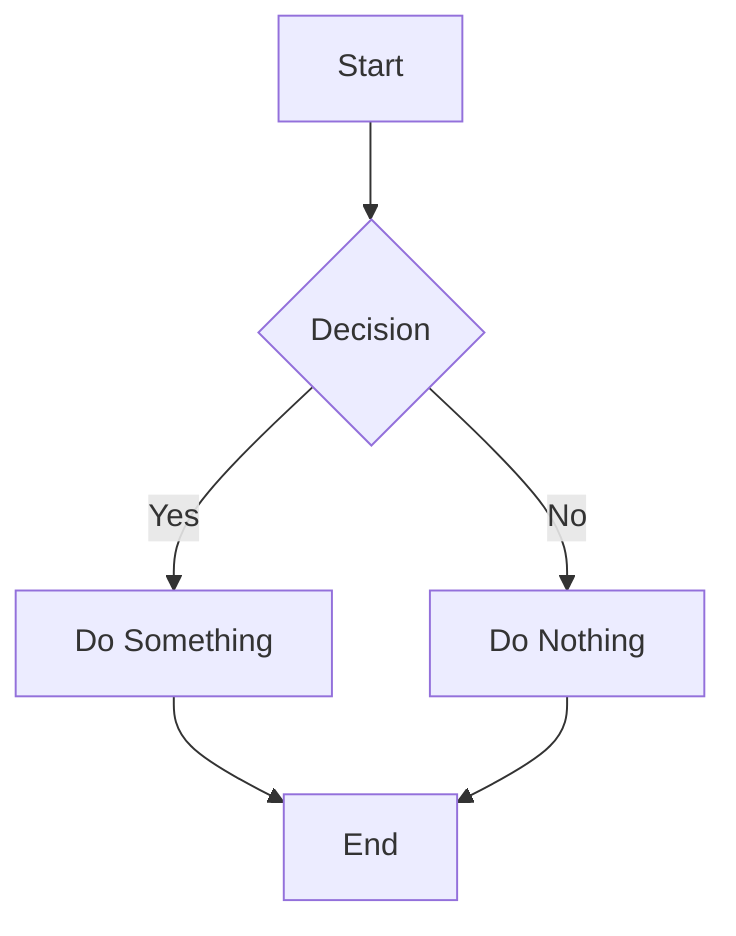
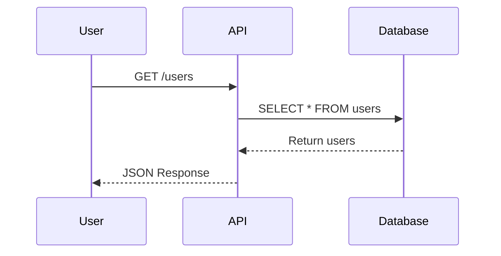
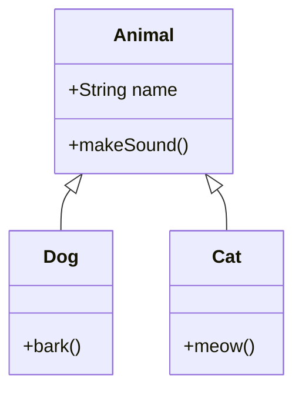
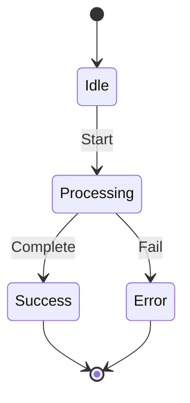
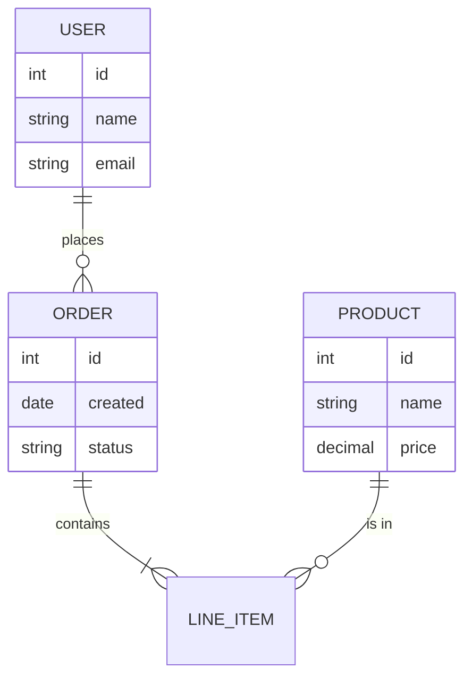
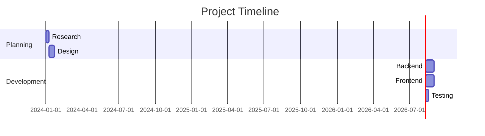
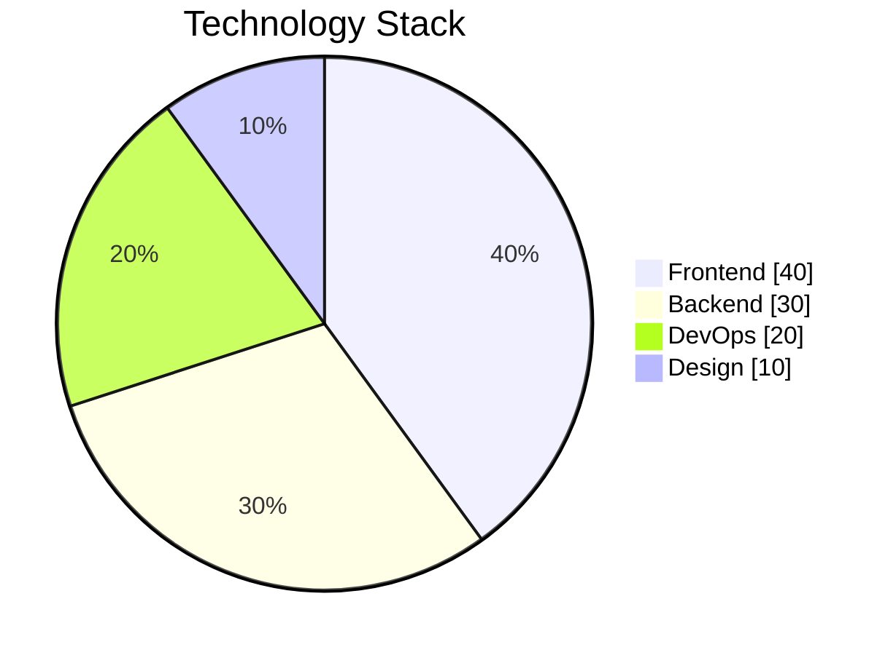
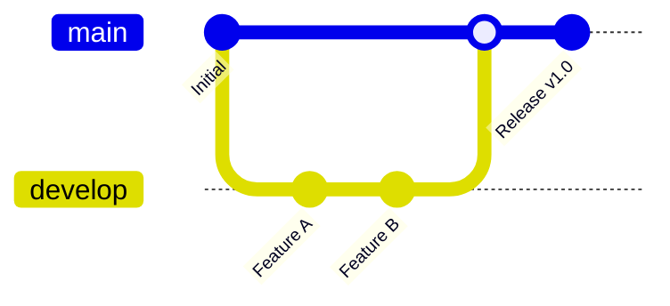
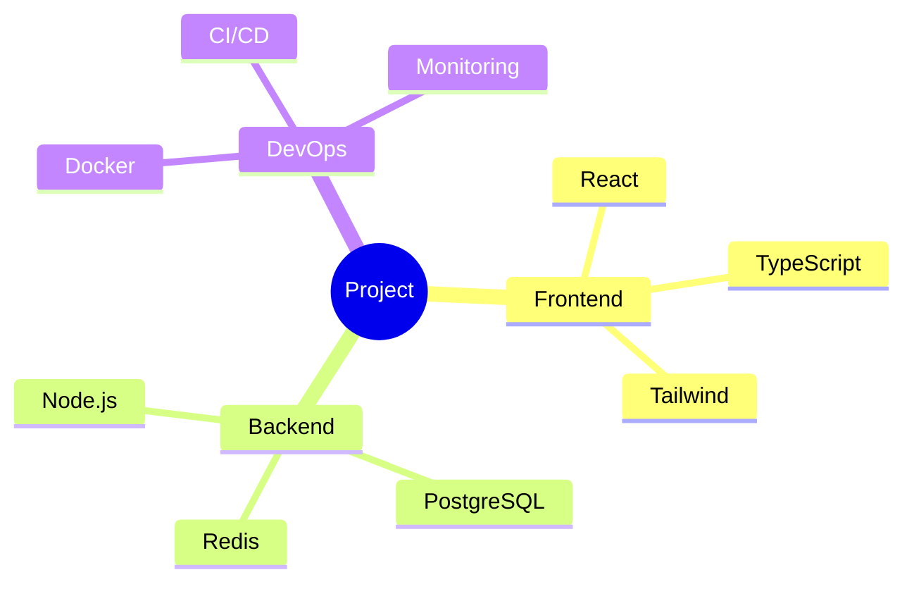
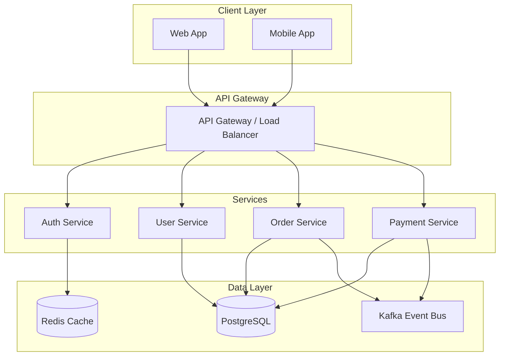

```codehike
const greeting = "Hello, Code Hike!";
console.log(greeting);
```

```codehike javascript
function fibonacci(n: number): number {
  if (n <= 1) return n
  return fibonacci(n - 1) + fibonacci(n - 2)
}

console.log(fibonacci(10))
```

```codehike
function greet(name: string) {
  // !border(1:3)
  const greeting = `Hello, ${name}!`
  console.log(greeting)
  return greeting
}

greet("World")
```

```codehike
function calculateTotal(items: number[]) {
  let total = 0
  // !focus
  for (const item of items) {
    total += item
  }
  // !focus
  return total
}

console.log(calculateTotal([1, 2, 3, 4, 5]))
```

```codehike
function processData(data: string[]) {
  // !bg(red)
  const filtered = data.filter(item => item.length > 3)
  // !bg(green)
  const mapped = filtered.map(item => item.toUpperCase())
  return mapped
}

console.log(processData(["hi", "hello", "hey", "world"]))
```

```codehike
const config = {
  // !mark
  apiUrl: "https://api.example.com",
  timeout: 5000,
  retries: 3
}
```

```codehike
function oldFunction() {
  // !diff(-)
  const oldValue = 42
  // !diff(+)
  const newValue = 43
  return newValue
}
```

```codehike
const api = {
  // !mark[10:30]
  endpoint: "https://api.example.com/v1/users",
  timeout: 5000
}
```

```codehike
const patterns = {
  // !highlight/\.toUpperCase\(\)/g
  transform: (str: string) => str.toUpperCase(),
  // !highlight/\.toLowerCase\(\)/g
  normalize: (str: string) => str.toLowerCase()
}
```

```codehike
function fetchData(url: string) {
  // !callout(This fetches data from the API endpoint)
  return fetch(url).then(res => res.json())
}
```

```codehike
const config = {
  // !tooltip[10:25](This is the API base URL)
  baseUrl: "https://api.example.com/v1"
}
```

```codehike
// !link(https://github.com/example/repo)
const repo = "https://github.com/example/repo"
```

```codehike
function calculate() {
  const result = 2 + 2 // !footnote(This is a footnote explaining the calculation)
  return result
}
```

```codehike
const status = "pending" // !label(This is a status label)
```

```codehike
const important = "Do not delete!" // !style(color: red; font-weight: bold)
```

```codehike
function longFunction() {
  // !fold
  console.log("This section can be folded")
  console.log("Line 2")
  console.log("Line 3")
  // !fold(end)
  console.log("This is always visible")
}
```

```codehike
// !classname(custom-highlight)
function specialFunction() {
  return "special"
}
```

```codehike wrap
function veryLongFunctionNameThatExceedsTheViewportWidthAndNeedsWrappingToBeVisible(parameterOne: string, parameterTwo: number, parameterThree: boolean): string {
  return `${parameterOne}-${parameterTwo}-${parameterThree}`
}
```

```codehike slideshow
// Slide 1
console.log("Slide 1: Introduction")

// ---
// Slide 2
console.log("Slide 2: Main Content")

// ---
// Slide 3
console.log("Slide 3: Conclusion")
```

```codehike javascript wrap
// !focus
function highlightThis() {
  // !border(red)
  const important = "This line has a red border"
  // !bg(yellow)
  const highlighted = "This line has yellow background"
  return { important, highlighted }
}
```



















```interactive
<!-- preset: steps -->
<p>Welcome to the interactive steps demo! Click <strong>Next</strong> to continue.</p>
<p>Step 2: You can use <em>HTML</em> inside steps including <strong>bold</strong>, <em>italic</em>, and even <code>inline code</code>.</p>
<p>Step 3: Add as many steps as you need for your tutorial or walkthrough.</p>
<p>Step 4: This is the final step. Click <strong>Done</strong> to finish!</p>
```

```interactive
<!-- preset: quiz -->
<div data-question="What is the capital of France?" data-options="London|Paris|Berlin|Madrid" data-correct="1"></div>
<div data-question="Which planet is known as the Red Planet?" data-options="Venus|Mars|Jupiter|Saturn" data-correct="1"></div>
<div data-question="What is 2 + 2?" data-options="3|4|5|6" data-correct="1"></div>
<div data-question="Who wrote 'Romeo and Juliet'?" data-options="Charles Dickens|William Shakespeare|Jane Austen|Mark Twain" data-correct="1"></div>
```

```interactive
<script type="module">
const container = document.currentScript.parentElement;

const btn = document.createElement('button');
btn.textContent = 'Click me!';
btn.style.cssText = 'padding:12px 24px;border-radius:8px;background:var(--accent);color:var(--bg-primary);font-weight:bold;cursor:pointer;border:none;font-size:14px;';

const output = document.createElement('div');
output.style.cssText = 'margin-top:16px;padding:16px;border-radius:8px;background:var(--bg-card);border:1px solid var(--border);font-size:14px;color:var(--text-primary);';
output.textContent = 'Interact with the button above.';

let count = 0;
btn.onclick = () => { count++; output.textContent = 'Clicked ' + count + ' time' + (count !== 1 ? 's' : '') + '!'; };

container.appendChild(btn);
container.appendChild(output);
</script>
```

```interactive
<script type="module">
const container = document.currentScript.parentElement;

const state = { count: 0, history: [] as number[] };

const render = () => {
  container.innerHTML = '';
  
  const display = document.createElement('div');
  display.style.cssText = 'font-size: 48px; font-weight: bold; text-align: center; margin: 20px 0; color: var(--accent);';
  display.textContent = state.count;
  
  const btnContainer = document.createElement('div');
  btnContainer.style.cssText = 'display: flex; gap: 10px; justify-content: center; flex-wrap: wrap;';
  
  const createBtn = (text: string, onClick: () => void, variant = 'primary') => {
    const btn = document.createElement('button');
    btn.textContent = text;
    btn.onclick = onClick;
    const baseStyle = 'padding: 10px 20px; border-radius: 8px; font-weight: 600; cursor: pointer; border: none; font-size: 14px; transition: all 0.2s;';
    if (variant === 'primary') {
      btn.style.cssText = baseStyle + 'background: var(--accent); color: var(--bg-primary);';
    } else if (variant === 'secondary') {
      btn.style.cssText = baseStyle + 'background: var(--bg-card); color: var(--text-primary); border: 1px solid var(--border);';
    } else {
      btn.style.cssText = baseStyle + 'background: var(--destructive); color: white;';
    }
    btn.onmouseover = () => btn.style.transform = 'scale(1.02)';
    btn.onmouseout = () => btn.style.transform = 'scale(1)';
    return btn;
  };
  
  btnContainer.appendChild(createBtn('Increment', () => { state.count++; state.history.push(state.count); render(); }));
  btnContainer.appendChild(createBtn('Decrement', () => { state.count--; state.history.push(state.count); render(); }, 'secondary'));
  btnContainer.appendChild(createBtn('Reset', () => { state.count = 0; state.history = []; render(); }, 'secondary'));
  btnContainer.appendChild(createBtn('Clear History', () => { state.history = []; render(); }, 'danger'));
  
  const history = document.createElement('div');
  history.style.cssText = 'margin-top: 20px; padding: 16px; background: var(--bg-card); border-radius: 8px; border: 1px solid var(--border); max-height: 200px; overflow-y: auto;';
  history.innerHTML = '<strong>History:</strong> ' + (state.history.length ? state.history.join(', ') : 'Empty');
  
  container.appendChild(display);
  container.appendChild(btnContainer);
  container.appendChild(history);
};

render();
</script>
```

```interactive-3d
<canvas id="scene1"></canvas>
<script type="module">
import * as THREE from 'three'

const canvas = document.getElementById('scene1')
const scene = new THREE.Scene()
const camera = new THREE.PerspectiveCamera(75, canvas.clientWidth / canvas.clientHeight, 0.1, 1000)
const renderer = new THREE.WebGLRenderer({ canvas, antialias: true, alpha: true })
renderer.setSize(canvas.clientWidth, canvas.clientHeight)
renderer.setPixelRatio(window.devicePixelRatio)

const geometry = new THREE.BoxGeometry(1, 1, 1)
const material = new THREE.MeshStandardMaterial({ 
  color: 0x3b82f6,
  metalness: 0.3,
  roughness: 0.4
})
const cube = new THREE.Mesh(geometry, material)
scene.add(cube)

const ambientLight = new THREE.AmbientLight(0xffffff, 0.5)
scene.add(ambientLight)

const directionalLight = new THREE.DirectionalLight(0xffffff, 1)
directionalLight.position.set(5, 5, 5)
scene.add(directionalLight)

camera.position.z = 3

function animate() {
  requestAnimationFrame(animate)
  cube.rotation.x += 0.01
  cube.rotation.y += 0.01
  renderer.render(scene, camera)
}
animate()

const resizeObserver = new ResizeObserver(entries => {
  for (const entry of entries) {
    const width = entry.contentRect.width
    const height = entry.contentRect.height
    camera.aspect = width / height
    camera.updateProjectionMatrix()
    renderer.setSize(width, height)
  }
})
resizeObserver.observe(canvas)
</script>
```

```interactive-3d
<canvas id="torus"></canvas>
<script type="module">
import * as THREE from 'three'

const canvas = document.getElementById('torus')
const scene = new THREE.Scene()
const camera = new THREE.PerspectiveCamera(75, canvas.clientWidth / canvas.clientHeight, 0.1, 1000)
const renderer = new THREE.WebGLRenderer({ canvas, antialias: true, alpha: true })
renderer.setSize(canvas.clientWidth, canvas.clientHeight)
renderer.setPixelRatio(window.devicePixelRatio)

const geometry = new THREE.TorusKnotGeometry(0.5, 0.15, 100, 16)
const material = new THREE.MeshPhysicalMaterial({
  color: 0x8b5cf6,
  metalness: 0.2,
  roughness: 0.3,
  clearcoat: 1,
  clearcoatRoughness: 0.1
})
const torusKnot = new THREE.Mesh(geometry, material)
scene.add(torusKnot)

const light1 = new THREE.PointLight(0x3b82f6, 100)
light1.position.set(5, 5, 5)
scene.add(light1)

const light2 = new THREE.PointLight(0xec4899, 100)
light2.position.set(-5, -5, -5)
scene.add(light2)

camera.position.z = 3

function animate() {
  requestAnimationFrame(animate)
  torusKnot.rotation.x += 0.005
  torusKnot.rotation.y += 0.008
  torusKnot.rotation.z += 0.003
  renderer.render(scene, camera)
}
animate()

new ResizeObserver(entries => {
  for (const entry of entries) {
    camera.aspect = entry.contentRect.width / entry.contentRect.height
    camera.updateProjectionMatrix()
    renderer.setSize(entry.contentRect.width, entry.contentRect.height)
  }
}).observe(canvas)
</script>
```

```interactive-3d
<canvas id="particles"></canvas>
<script type="module">
import * as THREE from 'three'

const canvas = document.getElementById('particles')
const scene = new THREE.Scene()
const camera = new THREE.PerspectiveCamera(75, canvas.clientWidth / canvas.clientHeight, 0.1, 1000)
const renderer = new THREE.WebGLRenderer({ canvas, antialias: true, alpha: true })
renderer.setSize(canvas.clientWidth, canvas.clientHeight)
renderer.setPixelRatio(window.devicePixelRatio)

const particles = 2000
const geometry = new THREE.BufferGeometry()
const positions = new Float32Array(particles * 3)
const colors = new Float32Array(particles * 3)
const sizes = new Float32Array(particles)

for (let i = 0; i < particles; i++) {
  const radius = 2 + Math.random() * 3
  const theta = Math.random() * Math.PI * 2
  const phi = Math.acos(2 * Math.random() - 1)
  
  positions[i * 3] = radius * Math.sin(phi) * Math.cos(theta)
  positions[i * 3 + 1] = radius * Math.sin(phi) * Math.sin(theta)
  positions[i * 3 + 2] = radius * Math.cos(phi)
  
  const hue = Math.random()
  colors[i * 3] = hue
  colors[i * 3 + 1] = 0.8
  colors[i * 3 + 2] = 0.9
  
  sizes[i] = Math.random() * 2 + 0.5
}

geometry.setAttribute('position', new THREE.BufferAttribute(positions, 3))
geometry.setAttribute('color', new THREE.BufferAttribute(colors, 3))
geometry.setAttribute('size', new THREE.BufferAttribute(sizes, 1))

const material = new THREE.PointsMaterial({
  size: 0.05,
  vertexColors: true,
  transparent: true,
  opacity: 0.8,
  sizeAttenuation: true
})

const points = new THREE.Points(geometry, material)
scene.add(points)

camera.position.z = 8

let time = 0
function animate() {
  requestAnimationFrame(animate)
  time += 0.005
  
  points.rotation.y = time * 0.1
  points.rotation.x = Math.sin(time * 0.5) * 0.2
  
  const positions = geometry.attributes.position.array as Float32Array
  for (let i = 0; i < particles; i++) {
    positions[i * 3 + 1] += Math.sin(time + i * 0.1) * 0.002
  }
  geometry.attributes.position.needsUpdate = true
  
  renderer.render(scene, camera)
}
animate()

new ResizeObserver(entries => {
  for (const entry of entries) {
    camera.aspect = entry.contentRect.width / entry.contentRect.height
    camera.updateProjectionMatrix()
    renderer.setSize(entry.contentRect.width, entry.contentRect.height)
  }
}).observe(canvas)
</script>
```

```chart
type: bar
title: Monthly Sales
labels: [Jan, Feb, Mar, Apr, May, Jun]
datasets:
  - label: Sales 2024
    data: [65, 59, 80, 81, 56, 55]
    color: #3b82f6
  - label: Sales 2023
    data: [28, 48, 40, 19, 86, 27]
    color: #10b981
```

```chart
type: line
title: Website Traffic
labels: [Mon, Tue, Wed, Thu, Fri, Sat, Sun]
datasets:
  - label: Visitors
    data: [120, 190, 300, 500, 230, 440, 310]
    color: #8b5cf6
    fill: true
  - label: Page Views
    data: [200, 400, 350, 600, 300, 700, 500]
    color: #f97316
    fill: true
```

```chart
type: doughnut
title: Browser Market Share
labels: [Chrome, Firefox, Safari, Edge, Other]
datasets:
  - label: Market Share
    data: [65, 15, 12, 5, 3]
    color: [#3b82f6, #f97316, #10b981, #8b5cf6, #6b7280]
```

```chart
type: radar
title: Skill Assessment
labels: [JavaScript, TypeScript, React, Node.js, Python, CSS]
datasets:
  - label: Current Level
    data: [90, 85, 88, 75, 60, 80]
    color: #3b82f6
  - label: Target Level
    data: [95, 90, 92, 85, 75, 85]
    color: #10b981
```

```chart
type: line
title: Revenue Growth
labels: [Q1, Q2, Q3, Q4]
datasets:
  - label: Revenue
    data: [100, 150, 200, 280]
    color: #22c55e
    fill: true
    backgroundColor: rgba(34, 197, 94, 0.1)
```

```chart
type: scatter
title: Height vs Weight
labels: []
datasets:
  - label: Male
    data: [{x: 170, y: 65}, {x: 180, y: 80}, {x: 175, y: 72}, {x: 185, y: 85}, {x: 165, y: 60}]
    color: #3b82f6
  - label: Female
    data: [{x: 160, y: 55}, {x: 165, y: 60}, {x: 155, y: 50}, {x: 170, y: 65}, {x: 158, y: 52}]
    color: #ec4899
```

```remotion
{
  "src": "https://commondatastorage.googleapis.com/gtv-videos-bucket/sample/BigBuckBunny.mp4",
  "title": "Big Buck Bunny",
  "controls": true,
  "loop": false
}
```

```javascript
async function fetchUserData(userId) {
  try {
    const response = await fetch(`/api/users/${userId}`)
    if (!response.ok) throw new Error('User not found')
    return await response.json()
  } catch (error) {
    console.error('Failed to fetch user:', error)
    throw error
  }
}

export default fetchUserData
```

```typescript
interface User {
  id: string
  name: string
  email: string
  role: 'admin' | 'user' | 'guest'
}

type UserRole = User['role']

function hasPermission(user: User, requiredRole: UserRole): boolean {
  const roleHierarchy: Record<UserRole, number> = {
    guest: 0,
    user: 1,
    admin: 2
  }
  return roleHierarchy[user.role] >= roleHierarchy[requiredRole]
}
```

```python
import asyncio
from typing import List, Optional
from dataclasses import dataclass

@dataclass
class Task:
    id: int
    title: str
    completed: bool = False

class TaskManager:
    def __init__(self):
        self.tasks: List[Task] = []
    
    def add_task(self, title: str) -> Task:
        task = Task(id=len(self.tasks) + 1, title=title)
        self.tasks.append(task)
        return task
    
    def complete_task(self, task_id: int) -> Optional[Task]:
        for task in self.tasks:
            if task.id == task_id:
                task.completed = True
                return task
        return None

async def main():
    manager = TaskManager()
    manager.add_task("Learn Rust")
    manager.add_task("Build a CLI tool")
    print(f"Total tasks: {len(manager.tasks)}")

if __name__ == "__main__":
    asyncio.run(main())
```

```rust
use std::collections::HashMap;
use serde::{Deserialize, Serialize};

#[derive(Debug, Serialize, Deserialize)]
struct User {
    id: u64,
    username: String,
    email: String,
    roles: Vec<String>,
}

impl User {
    fn new(id: u64, username: String, email: String) -> Self {
        Self {
            id,
            username,
            email,
            roles: vec!["user".to_string()],
        }
    }
    
    fn add_role(&mut self, role: String) {
        if !self.roles.contains(&role) {
            self.roles.push(role);
        }
    }
    
    fn has_role(&self, role: &str) -> bool {
        self.roles.contains(&role.to_string())
    }
}

fn main() {
    let mut user = User::new(1, "johndoe".to_string(), "john@example.com".to_string());
    user.add_role("admin".to_string());
    println!("User: {:?}", user);
    println!("Is admin: {}", user.has_role("admin"));
}
```

```go
package main

import (
    "encoding/json"
    "fmt"
    "net/http"
    "sync"
)

type User struct {
    ID    int    `json:"id"`
    Name  string `json:"name"`
    Email string `json:"email"`
}

var (
    users  = make(map[int]User)
    mu     sync.RWMutex
    nextID = 1
)

func createUser(w http.ResponseWriter, r *http.Request) {
    var user User
    if err := json.NewDecoder(r.Body).Decode(&user); err != nil {
        http.Error(w, err.Error(), http.StatusBadRequest)
        return
    }
    
    mu.Lock()
    user.ID = nextID
    nextID++
    users[user.ID] = user
    mu.Unlock()
    
    w.Header().Set("Content-Type", "application/json")
    json.NewEncoder(w).Encode(user)
}

func getUser(w http.ResponseWriter, r *http.Request) {
    id := r.URL.Query().Get("id")
}

func main() {
    http.HandleFunc("/users", createUser)
    http.HandleFunc("/user", getUser)
    fmt.Println("Server starting on :8080")
    http.ListenAndServe(":8080", nil)
}
```

```css
:root {
  --primary: #3b82f6;
  --secondary: #64748b;
  --accent: #f59e0b;
  --background: #0f172a;
  --surface: #1e293b;
  --text-primary: #f8fafc;
  --text-secondary: #94a3b8;
}

.card {
  background: var(--surface);
  border: 1px solid var(--border);
  border-radius: 12px;
  padding: 1.5rem;
  transition: transform 0.2s ease, box-shadow 0.2s ease;
}

.card:hover {
  transform: translateY(-2px);
  box-shadow: 0 12px 24px -8px rgba(0, 0, 0, 0.3);
}

@media (max-width: 768px) {
  .card {
    padding: 1rem;
  }
}
```

```html
<!DOCTYPE html>
<html lang="en">
<head>
  <meta charset="UTF-8">
  <meta name="viewport" content="width=device-width, initial-scale=1.0">
  <title>Document</title>
</head>
<body>
  <header>
    <nav>
      <ul>
        <li><a href="/">Home</a></li>
        <li><a href="/about">About</a></li>
        <li><a href="/contact">Contact</a></li>
      </ul>
    </nav>
  </header>
  <main>
    <article>
      <h1>Welcome</h1>
      <p>This is a semantic HTML5 document.</p>
    </article>
  </main>
</body>
</html>
```

```sql
WITH user_stats AS (
  SELECT 
    u.id,
    u.username,
    COUNT(p.id) as post_count,
    MAX(p.created_at) as last_post
  FROM users u
  LEFT JOIN posts p ON u.id = p.user_id
  WHERE u.created_at > '2024-01-01'
  GROUP BY u.id, u.username
  HAVING COUNT(p.id) > 0
)
SELECT 
  username,
  post_count,
  last_post,
  CASE 
    WHEN post_count > 100 THEN 'Power User'
    WHEN post_count > 10 THEN 'Active User'
    ELSE 'New User'
  END as user_tier
FROM user_stats
ORDER BY post_count DESC
LIMIT 20;
```

```json
{
  "name": "my-project",
  "version": "1.0.0",
  "description": "A sample project",
  "scripts": {
    "dev": "vite",
    "build": "tsc && vite build",
    "preview": "vite preview",
    "test": "vitest"
  },
  "dependencies": {
    "react": "^18.2.0",
    "react-dom": "^18.2.0"
  },
  "devDependencies": {
    "@types/react": "^18.2.0",
    "typescript": "^5.0.0",
    "vite": "^5.0.0"
  }
}
```

```yaml
version: '3.8'
services:
  app:
    build: .
    ports:
      - "3000:3000"
    environment:
      - NODE_ENV=production
      - DATABASE_URL=postgresql://user:pass@db:5432/app
    depends_on:
      - db
    volumes:
      - ./src:/app/src
  
  db:
    image: postgres:15-alpine
    environment:
      - POSTGRES_USER=user
      - POSTGRES_PASSWORD=pass
      - POSTGRES_DB=app
    volumes:
      - postgres_data:/var/lib/postgresql/data

volumes:
  postgres_data:
```

```bash
#!/bin/bash
set -euo pipefail

echo "Building application..."
npm run build

echo "Running tests..."
npm run test

echo "Deploying to server..."
rsync -avz dist/ user@server:/var/www/app/

echo "Restarting service..."
ssh user@server "sudo systemctl restart app"

echo "Deployment complete!"
```

```codehike typescript
function processUserData(users: User[]) {
  // !focus
  const activeUsers = users.filter(u => u.isActive)
  // !border(blue)
  const sortedUsers = activeUsers.sort((a, b) => b.score - a.score)
  // !bg(green)
  const topUsers = sortedUsers.slice(0, 10)
  
  // !callout(This returns the top 10 active users by score)
  return topUsers.map(u => ({
    id: u.id,
    name: u.name,
    score: u.score
  }))
}

interface User {
  id: string
  name: string
  score: number
  isActive: boolean
}
```

```interactive
<!-- preset: steps -->
<p>Welcome to the <strong>React Hooks Tutorial</strong>! Let's learn step by step.</p>
<p><strong>Step 1:</strong> <code>useState</code> manages local component state.</p>
<p><strong>Step 2:</strong> <code>useEffect</code> handles side effects like data fetching.</p>
<p><strong>Step 3:</strong> <code>useContext</code> shares data across components without props.</p>
<p><strong>Step 4:</strong> <code>useReducer</code> manages complex state logic.</p>
<p><strong>Step 5:</strong> Custom hooks extract reusable stateful logic.</p>
```



```chart
type: bar
title: Q4 2024 Performance Metrics
labels: [Oct, Nov, Dec]
datasets:
  - label: Revenue ($)
    data: [125000, 142000, 158000]
    color: #22c55e
  - label: Users
    data: [5200, 6100, 7300]
    color: #3b82f6
  - label: Conversions (%)
    data: [3.2, 3.8, 4.1]
    color: #f59e0b
```

```codehike
// Line 1
const a = 1
// Line 2
const b = 2
// Line 3
const c = 3
// Line 4
const d = 4
// Line 5
const e = 5
// Line 6
const f = 6
// Line 7
const g = 7
// Line 8
const h = 8
// Line 9
const i = 9
// Line 10
const j = 10
// Line 11
const k = 11
// Line 12
const l = 12
// Line 13
const m = 13
// Line 14
const n = 14
// Line 15
const o = 15
// Line 16
const p = 16
// Line 17
const q = 17
// Line 18
const r = 18
// Line 19
const s = 19
// Line 20
const t = 20
// Line 21
const u = 21
// Line 22
const v = 22
// Line 23
const w = 23
// Line 24
const x = 24
// Line 25
const y = 25
// Line 26
const z = 26
console.log('All variables declared')
```

```codehike
```

```codehike
// This is a comment
// Another comment
// !focus
// Focused comment
// !border
// Bordered comment
```

```interactive
<script type="module">
const container = document.currentScript.parentElement;

const pre = document.createElement('pre');
pre.style.cssText = 'background: var(--bg-card); padding: 16px; border-radius: 8px; overflow-x: auto; border: 1px solid var(--border);';
pre.innerHTML = `<code>const example = "This is code inside interactive block";\nconsole.log(example);</code>`;

container.appendChild(pre);
</script>
```