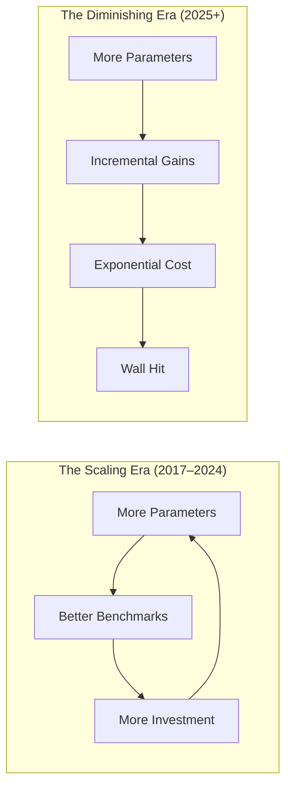
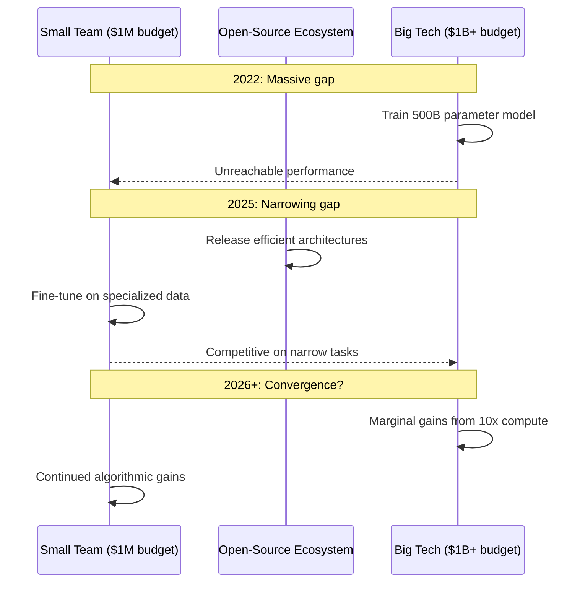
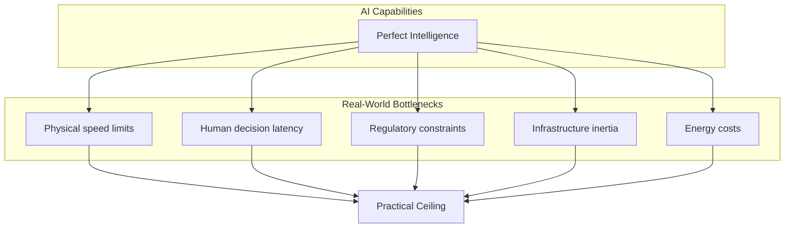
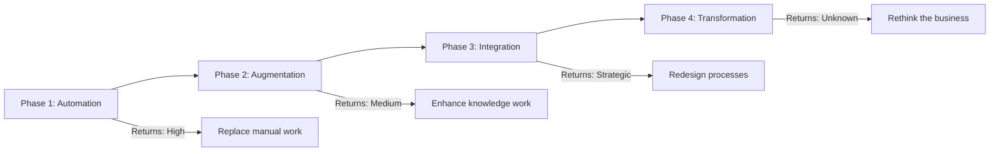

# The Laws of Diminishing Returns in AI: When Bigger Is No Longer Better

For years, the AI industry bet that more compute, more data, and larger models would keep delivering better intelligence. The scaling law was gospel — double the parameters, double the performance. That assumption is now breaking down. Returns on scale are shrinking, and the question is shifting from "how big can we make it?" to "how smart can we be with what we have?"

This article covers six areas where diminishing returns are showing up in AI and what they mean for the industry.

---

## 1. The Scaling Law Wall

The most foundational diminishing returns debate is whether scaling current architectures is still a viable path forward.



Research from MIT and other institutions has confirmed what many practitioners have suspected: the performance gains from pouring additional compute into large language models are diminishing. A model that scales its compute budget 3.6x annually may only hold a fleeting performance advantage over smaller, more efficient competitors.

### The Core Problem

| Era | Approach | Cost Trend | Performance Trend |
|-----|----------|-----------|-------------------|
| 2017–2022 | Scale parameters | Linear growth | Super-linear gains |
| 2023–2024 | Scale compute + data | Exponential growth | Linear gains |
| 2025+ | Scale everything | Hyper-exponential | Sub-linear / plateau |

The takeaway: **the advantage built on pure compute is eroding**. A "meek model" with a well-optimized budget can now rival billion-dollar systems on most benchmarks.

---

## 2. The "Meek" vs. "Massive" Model Dynamic

If scaling laws are flattening, the playing field tilts. Who wins stops being about GPU count and starts being about what you do with them.



### The Democratization Effect

There is a real upside here: **smaller teams catch up**. When the biggest models stop getting significantly better, the field levels. Small teams with unique datasets and domain expertise can compete with tech giants. The focus shifts from pure compute to:

1. **Data quality** over data quantity
2. **Domain-specific fine-tuning** over general-purpose scale
3. **Inference optimization** over training scale
4. **Product integration** over model size

One policy angle: regulations focused on restricting compute access may soon become ineffective if algorithmic efficiency outpaces hardware constraints.

---

## 3. The Productivity Plateau

For businesses, the diminishing returns are most visible in productivity gains. Early AI adoption delivered dramatic efficiency improvements — automating customer support, generating marketing copy, summarizing documents. But those gains are becoming table stakes.

### The S-Curve of AI Productivity

```
Productivity Gain
    ^
    |     _______
    |    /       \
    |   /         \
    |  /           \
    | /             \
    |/               \
    +----------------------->
        Time → Early → Late
```

The early adopters saw a steep curve. Late adopters see a flatter one. And companies already using AI across their workflows are finding that each new AI tool delivers smaller marginal gains than the last.

### Strategy Shift

| Phase | Focus | Returns |
|-------|-------|---------|
| Phase 1 | Automate repetitive tasks | High |
| Phase 2 | Augment knowledge workers | Medium |
| Phase 3 | Reimagine business models | Emerging |
| Phase 4 | Structural transformation | Unknown |

The real advantage now comes not from using AI to do the same things faster, but from **rethinking what business you're in**. The winners will be those who move from "AI as a productivity tool" to "AI as a business model enabler."

---

## 4. The Augmentation Trap

Perhaps the most insidious diminishing return is the effect of AI on the humans using it.

### What Is the Augmentation Trap?

Studies have shown that sustained AI use can erode the very skills it augments. When a junior developer relies on GitHub Copilot to write every function, their ability to write code from scratch atrophies. When a data analyst uses AI to generate every SQL query, their mental model of the database weakens.

```csharp
// Without AI: Developer builds mental model of the code
// With AI: Developer reviews and accepts suggestions

// The skill transfer shifts from "active construction"
// to "passive verification" — a fundamentally different
// cognitive process that builds different neural pathways
```

### The Deskilling Cycle

```mermaid
flowchart TD
    A[Use AI Tool] --> B[Short-term productivity gain]
    B --> C[Less practice of core skill]
    C --> D[Skill degradation]
    D --> E[More reliance on AI]
    E --> F[Less confidence without AI]
    F --> G[Further skill erosion]
    G --> A
    
    style A fill:#1e3a5f
    style D fill:#7f1d1d
    style G fill:#7f1d1d
```



### Who Is Most at Risk?

The "augmentation trap" is most dangerous when:

- AI is used for **cognitive tasks that are also the primary means of skill development**
- The user is **early in their career** and hasn't built deep expertise yet
- Feedback loops are **slow or absent** (no one reviews the AI's output critically)
- The task is **complex but the AI makes it look easy** (creating an illusion of understanding)

### Breaking the Trap

1. **Deliberate practice**: Use AI for exploration, not replacement
2. **Review and critique**: Always question AI output, don't just accept it
3. **Rotation**: Periodically work without AI assistance to maintain skills
4. **Teaching**: Explaining AI-generated solutions to others solidifies understanding

---

## 5. Domain-Specific Limits: Where AI Hits the Wall

Different domains have different tolerance for error, and that determines where diminishing returns bite hardest.

### The Lossy vs. Lossless Spectrum

```chart
type: bar
title: AI Viability by Domain
labels: [Image gen, Marketing, Code gen, Legal, Medical, Aviation]
datasets:
  - label: AI Viability
    data: [90, 85, 65, 40, 25, 15]
    color: #3b82f6
  - label: Human Oversight Needed
    data: [20, 30, 60, 85, 95, 100]
    color: #ef4444
```

### Case Study: Legal AI

Getting to 60% accuracy on legal document analysis might take months. Pushing to 80% takes years. Achieving the 95–100% required for professional liability is, for most tasks, practically impossible without massive human oversight.

```chart
type: line
title: Accuracy vs. Investment — The Diminishing Returns Curve
labels: [0, 1, 2, 3, 4, 5, 6, 7, 8, 9, 10]
datasets:
  - label: Accuracy (%)
    data: [0, 25, 48, 64, 75, 82, 87, 90, 92, 93.5, 94]
    color: #3b82f6
  - label: Fast initial gains
    data: [null, 25, 48, 64, null, null, null, null, null, null, null]
    color: #10b981
  - label: Diminishing returns zone
    data: [null, null, null, null, null, 82, 87, 90, 92, 93.5, 94]
    color: #ef4444
```

The legal field illustrates a broader principle: **AI excels where "lossy" outputs are acceptable but struggles where "lossless" accuracy is mandatory.** This positions AI as an assistive tool, not a replacement, in high-stakes domains.

---

## 6. Intelligence Saturation: The Economic Ceiling

Even if AI continues to improve, there are physical and institutional bottlenecks that cap its economic impact.

### The Complementarity Constraint

Economic modeling suggests that returns to intelligence are fundamentally bounded by complementarity with the physical world. A perfect AI for a robot is useless if the robot arm moves at a fixed speed. The smartest logistics algorithm cannot build new roads or change zoning laws.



### What This Means

- **AI is a complement, not a substitute**, for physical capital and human institutions
- **Hyper-scale intelligence does not mean hyper-scale economic growth** — the surrounding systems become the bottleneck
- **Saturation is inevitable** — at some point, making the AI smarter yields no practical benefit because the physical world constrains what it can do

This challenges the idea that AGI will inevitably drive explosive, unbounded economic growth. The real limits may not be in the AI at all, but in the world it operates within.

---

## 7. What to Do About It

If diminishing returns are real across multiple dimensions, what does a smart strategy look like?

### For Researchers

- **Invest in new architectures** — neuro-symbolic AI, world models, and other approaches beyond next-token prediction
- **Focus on data efficiency** — how to learn more from less
- **Study reasoning** — not just pattern matching but actual causal understanding

### For Businesses

- **Don't chase model size** — better to fine-tune a capable small model on proprietary data
- **Build defensibility with data and UX**, not compute
- **Invest in human-AI collaboration** design, not automation

### For Individuals

- **Stay generalist** — deep expertise in one area complemented by AI literacy across others
- **Practice skills deliberately** — don't let AI automate your learning
- **Develop judgment** — the ability to evaluate AI output is becoming the most valuable meta-skill

### The Maturity Model



---

## Key Takeaways

1. **Scaling laws are flattening** — more compute yields diminishing returns, leveling the playing field between small teams and tech giants
2. **Productivity gains are commoditizing** — AI efficiency is becoming table stakes, not competitive advantage
3. **Human capital faces erosion** — the augmentation trap threatens the skills AI depends on
4. **Domain ceilings are real** — high-stakes fields demand accuracy levels current AI cannot reliably deliver
5. **Economic saturation looms** — physical and institutional bottlenecks cap AI's transformative potential

The "bigger is always better" era is ending. What comes next will be defined not by who has the most GPUs, but by who uses intelligence — artificial and human — most wisely.

---

## 8. Interactive Presentation: The Diminishing Returns Deck

Walk through the six dimensions step by step.

```interactive
<!-- preset: steps -->
<p><strong style="color:var(--accent);font-size:1.2em;">The Diminishing Returns of AI</strong><br/><br/>Six areas where bigger is no longer better. Use <strong>Next</strong> and <strong>Prev</strong> to move between them.<br/><br/><span style="display:inline-block;padding:8px 16px;border-radius:8px;background:var(--accent);color:var(--bg-primary);font-weight:bold;">Start →</span></p>
<p><strong style="color:var(--accent);">1. The Scaling Law Wall</strong><br/><br/>For years, scaling parameters was the winning formula. But MIT research confirms that each additional unit of compute now yields <strong>smaller performance gains</strong>. A model scaling compute 3.6x annually holds only a fleeting advantage.<br/><br/><span style="color:var(--text-muted);">Core insight: The compute moat is eroding.</span></p>
<p><strong style="color:var(--accent);">2. Meek vs. Massive</strong><br/><br/>When big models stop getting significantly better, the field <strong>levels</strong>. Small teams with unique data and domain expertise can compete with tech giants. Advantage shifts from GPU count to <strong>strategy</strong>.<br/><br/><span style="color:var(--text-muted);">Core insight: Democratization through diminishing returns.</span></p>
<p><strong style="color:var(--accent);">3. The Productivity Plateau</strong><br/><br/>Early AI adoption delivered dramatic efficiency gains. Now those gains are <strong>table stakes</strong>. Each new AI tool delivers smaller marginal improvements. The real advantage shifts to rethinking business models entirely.<br/><br/><span style="color:var(--text-muted);">Core insight: Efficiency no longer differentiates.</span></p>
<p><strong style="color:var(--accent);">4. The Augmentation Trap</strong><br/><br/>Sustained AI use can erode the skills it augments — a phenomenon called the "augmentation trap." Junior developers relying on Copilot may <strong>lose the ability to code from scratch</strong>. Over-reliance creates a deskilling cycle that's hard to break.<br/><br/><span style="color:var(--text-muted);">Core insight: Use AI for exploration, not replacement.</span></p>
<p><strong style="color:var(--accent);">5. Domain-Specific Limits</strong><br/><br/>AI excels where "lossy" outputs are acceptable (images, copy) but struggles where "lossless" accuracy is mandatory (law, medicine). Getting from 60% to 80% accuracy in legal analysis takes years. 95–100% is practically unattainable without heavy human oversight.<br/><br/><span style="color:var(--text-muted);">Core insight: Accuracy ceilings vary by domain.</span></p>
<p><strong style="color:var(--accent);">6. Intelligence Saturation</strong><br/><br/>Even perfect AI faces <strong>physical and institutional bottlenecks</strong>. A brilliant logistics algorithm cannot build new roads or change zoning laws. The smartest robot cannot move faster than its arm allows. Intelligence is bounded by the world it operates in.<br/><br/><span style="color:var(--text-muted);">Core insight: AI is a complement, not a substitute.</span></p>
<p><strong style="color:var(--accent);">The Way Forward</strong><br/><br/><span style="color:var(--text-muted);">For researchers:</span> Invest in new architectures (neuro-symbolic, world models)<br/><span style="color:var(--text-muted);">For businesses:</span> Build moats with data and UX, not compute<br/><span style="color:var(--text-muted);">For individuals:</span> Stay generalist, practice deliberately, develop judgment<br/><br/><span style="color:var(--accent);font-weight:bold;">The era of "bigger is always better" is ending.</span></p>
```

---

## 9. Three.js Visualization: The Diminishing Returns Curve

Explore the diminishing returns relationship in 3D. The curve shows investment (compute, data, parameters) on the X-axis and returns (performance, accuracy) on the Y-axis. Notice how the curve starts steep but flattens — and the bars transition from green (high returns) to red (diminishing returns). Drag to orbit, scroll to zoom.

```interactive-3d
<canvas id="diminishing-canvas"></canvas>
<script type="module">
import * as THREE from 'three';
import { OrbitControls } from 'three/addons/controls/OrbitControls.js';

const canvas = document.getElementById('diminishing-canvas');
const container = canvas.parentElement;
const width = container.clientWidth;
const height = container.clientHeight;

const scene = new THREE.Scene();
scene.background = new THREE.Color(0x0a0a0f);

const camera = new THREE.PerspectiveCamera(40, width / height, 0.1, 100);
camera.position.set(7, 5, 9);

const renderer = new THREE.WebGLRenderer({ canvas, antialias: true });
renderer.setSize(width, height);
renderer.setPixelRatio(Math.min(window.devicePixelRatio, 2));
renderer.shadowMap.enabled = true;
renderer.shadowMap.type = THREE.PCFSoftShadowMap;
renderer.toneMapping = THREE.ACESFilmicToneMapping;
renderer.toneMappingExposure = 1.2;

const controls = new OrbitControls(camera, renderer.domElement);
controls.enableDamping = true;
controls.dampingFactor = 0.08;
controls.target.set(2.5, 1.5, 0);
controls.minDistance = 3;
controls.maxDistance = 20;
controls.autoRotate = true;
controls.autoRotateSpeed = 1.2;

const ambientLight = new THREE.AmbientLight(0x222244, 0.6);
scene.add(ambientLight);

const mainLight = new THREE.DirectionalLight(0xffeedd, 2);
mainLight.position.set(8, 12, 6);
mainLight.castShadow = true;
scene.add(mainLight);

const fillLight = new THREE.DirectionalLight(0x4488ff, 0.5);
fillLight.position.set(-4, 3, -6);
scene.add(fillLight);

const rimLight = new THREE.DirectionalLight(0xcca03d, 0.4);
rimLight.position.set(-3, 1, 8);
scene.add(rimLight);

const curvePoints = [];
const steps = 60;
for (let i = 0; i <= steps; i++) {
    const t = i / steps;
    const x = t * 5;
    const y = 3 * (1 - Math.exp(-3.5 * t));
    curvePoints.push(new THREE.Vector3(x, y, 0));
}

const curveGeo = new THREE.BufferGeometry().setFromPoints(curvePoints);
const curveMat = new THREE.LineBasicMaterial({ color: 0xcca03d, transparent: true, opacity: 0.9 });
const curveLine = new THREE.Line(curveGeo, curveMat);
scene.add(curveLine);

const glowPoints = curvePoints.filter((_, i) => i % 2 === 0);
const glowGeo = new THREE.BufferGeometry().setFromPoints(glowPoints);
const glowMat = new THREE.PointsMaterial({
    color: 0xffaa44,
    size: 0.08,
    transparent: true,
    opacity: 0.6,
    blending: THREE.AdditiveBlending,
});
const glowParticles = new THREE.Points(glowGeo, glowMat);
scene.add(glowParticles);

const barCount = 14;
for (let i = 0; i < barCount; i++) {
    const t = i / (barCount - 1);
    const x = t * 5;
    const y = 3 * (1 - Math.exp(-3.5 * t));
    const barHeight = Math.max(y, 0.05);

    const barGeo = new THREE.BoxGeometry(0.22, barHeight, 0.22);
    const hue = 0.33 - t * 0.33;
    const color = new THREE.Color().setHSL(Math.max(hue, 0), 0.85, 0.5);
    const barMat = new THREE.MeshStandardMaterial({
        color,
        roughness: 0.3,
        metalness: 0.1,
        transparent: true,
        opacity: 0.85,
        emissive: color,
        emissiveIntensity: 0.15,
    });
    const bar = new THREE.Mesh(barGeo, barMat);
    bar.position.set(x, barHeight / 2, -0.4);
    bar.castShadow = true;
    scene.add(bar);
}

const gridHelper = new THREE.GridHelper(6, 12, 0x333355, 0x222244);
gridHelper.position.y = -0.01;
scene.add(gridHelper);

const axisLineMat = new THREE.LineBasicMaterial({ color: 0x666688, transparent: true, opacity: 0.5 });

const xAxisPoints = [new THREE.Vector3(-0.3, 0, 0), new THREE.Vector3(5.5, 0, 0)];
const xAxisGeo = new THREE.BufferGeometry().setFromPoints(xAxisPoints);
scene.add(new THREE.Line(xAxisGeo, axisLineMat));

const yAxisPoints = [new THREE.Vector3(0, -0.3, 0), new THREE.Vector3(0, 3.5, 0)];
const yAxisGeo = new THREE.BufferGeometry().setFromPoints(yAxisPoints);
scene.add(new THREE.Line(yAxisGeo, axisLineMat));

const floorGeo = new THREE.PlaneGeometry(7, 5);
const floorMat = new THREE.MeshStandardMaterial({
    color: 0x0a0a15,
    roughness: 0.9,
    metalness: 0,
    transparent: true,
    opacity: 0.5,
});
const floor = new THREE.Mesh(floorGeo, floorMat);
floor.rotation.x = -Math.PI / 2;
floor.position.set(2.5, -0.02, 0);
floor.receiveShadow = true;
scene.add(floor);

function addLabelSprite(text, x, y, z, color = '#888899', size = 0.4) {
    const div = document.createElement('div');
    div.textContent = text;
    div.style.color = color;
    div.style.fontSize = '14px';
    div.style.fontWeight = '600';
    div.style.fontFamily = 'monospace';
    div.style.textShadow = '0 2px 8px rgba(0,0,0,0.8)';
    div.style.background = 'rgba(10,10,15,0.6)';
    div.style.padding = '4px 10px';
    div.style.borderRadius = '4px';
    div.style.border = '1px solid rgba(255,255,255,0.1)';
    div.style.backdropFilter = 'blur(4px)';

    const label = new THREE.CSS2DObject(div);
    label.position.set(x, y, z);
    scene.add(label);
    return label;
}

import { CSS2DRenderer, CSS2DObject } from 'three/addons/renderers/CSS2DRenderer.js';

const labelRenderer = new CSS2DRenderer();
labelRenderer.setSize(width, height);
labelRenderer.domElement.style.position = 'absolute';
labelRenderer.domElement.style.top = '0';
labelRenderer.domElement.style.left = '0';
labelRenderer.domElement.style.pointerEvents = 'none';
container.appendChild(labelRenderer.domElement);

addLabelSprite('Investment (Compute / Data / Parameters)', 2.5, -0.7, 0, '#8888aa', 0.45);
addLabelSprite('Returns', -0.8, 1.8, 0, '#8888aa', 0.45);
addLabelSprite('HIGH RETURNS', 0.5, 0.2, 0.6, '#44cc66', 0.3);
addLabelSprite('DIMINISHING RETURNS', 4.2, 0.2, 0.6, '#cc4444', 0.3);
addLabelSprite('▲ Steep gains', 1.2, 2.6, 0.6, '#66dd88', 0.25);
addLabelSprite('▼ Plateau', 4.5, 1.1, 0.6, '#dd6666', 0.25);

function animate() {
    requestAnimationFrame(animate);
    controls.update();
    renderer.render(scene, camera);
    labelRenderer.render(scene, camera);
}
animate();

function handleResize() {
    const w = container.clientWidth;
    const h = container.clientHeight;
    camera.aspect = w / h;
    camera.updateProjectionMatrix();
    renderer.setSize(w, h);
    labelRenderer.setSize(w, h);
}
window.addEventListener('resize', handleResize);
</script>
```

---

## 10. Opinion: The Future Is Boring — and That's a Good Thing

Here is my take.

**We are entering the boring phase of AI — and that is a sign of maturity.**

Every transformative technology follows the same arc: a period of magical exponential progress followed by a long, unglamorous grind of incremental improvement. Electricity, aviation, the internet — all of them. AI is no different. The "scaling law hangover" we are experiencing is not a crisis. It is the technology growing up.

### What I Think Happens Next

**The next breakthrough will not come from a bigger model.** It will come from a dataset nobody has thought to curate, a novel loss function, or an architecture that is not a transformer. The easy wins from "throw more GPUs at it" are gone. What remains requires genuine insight — which favors the curious, not the wealthy.

**Most AI companies will fail.** Not because AI is overhyped, but because building a business around a technology whose returns are flattening is fundamentally different from building one during exponential growth. The winners will be those who solve real integration problems, not those with the best benchmark scores. The value is in the deployment — the pipelines, the monitoring, the human workflows that wrap around the model.

**The augmentation trap will become a generational divide.** We are already seeing it: senior engineers who can review AI-generated code critically because they learned to write it from scratch, versus junior engineers who can prompt their way to working code but cannot debug a subtle concurrency bug. The difference is not skill — it is the depth of the mental model built through struggle. The most valuable AI skill of the next decade will be the ability to work *without* AI when it matters.

**Regulation will shift from compute caps to liability.** As models commoditize and "who has the best base model" stops mattering, policy attention will move to downstream accountability. Who is liable when an AI-powered diagnostic tool misses a rare condition? Who owns the output of a model fine-tuned on proprietary data? These questions will shape regulation far more than training compute thresholds.

**Software engineering is not doomed — but the role is being redefined.** This is the most common fear I hear from developers, and it deserves a direct answer.

Yes, AI can now write functions, generate boilerplate, and even solve LeetCode mediums. But software engineering has never been about typing code. It is about:

- **Understanding the problem** — which requirements are real, which are noise, and what the user actually needs
- **Making trade-offs** — speed vs. maintainability, cost vs. performance, build vs. buy
- **Owning outcomes** — when the AI-generated code crashes in production at 3 AM, the engineer gets the call, not the model
- **Navigating legacy** — real systems are decade-old monoliths with six ORMs, no tests, and a `TODO: fix this` from 2018. AI cannot untangle that mess because it has never seen that exact combination of bad decisions before

The developers who will be replaced are not the ones who use AI — they are the ones who only knew how to translate specs into code. If your value was "write CRUD endpoints fast," that value is approaching zero. If your value is "design systems that are actually maintainable, understand the business domain deeply, and make judgment calls that no stakeholder can articulate," that value is increasing.

The paradox: **AI will not replace software engineers, but software engineers who refuse to use AI will be replaced by those who do.** The skill that matters is not coding — it is the judgment to evaluate, integrate, and orchestrate AI-generated code within a real system.

**AGI will not arrive with a bang — it will arrive with a whimper, or not at all.** The diminishing returns we are observing are not merely a function of scale; they may be a fundamental property of the statistical paradigm we are in. If intelligence requires causal understanding, not just pattern matching, then no amount of scaling will bridge that gap. The path to AGI, if it exists, runs through entirely different architectures — and those architectures may not benefit from scale the way transformers did.

### The Bottom Line

We spent the last five years asking "how big can we make it?" The next five years will be about "how useful can we make it?" That is a harder question, but a more interesting one.

The end of exponential scaling is not the end of AI progress. It is the end of the free lunch. From here on, progress costs more and delivers less per unit of effort — but the cumulative effect of thousands of small, hard-won improvements will still change the world. It will just happen quietly, behind the scenes, inside boring business software and unglamorous operational tooling.

And that, honestly, is exactly how it should be.

---

## References

1. **MIT Scaling Laws Research** — "Diminishing Returns for Scaling Compute in Large Language Models" (2024). MIT CSAIL. Demonstrated that performance gains per unit of compute decline as models scale, suggesting algorithmic efficiency may outpace hardware-driven improvements.

2. **Scaling Laws for Neural Language Models** — Kaplan, J., et al. (2020). OpenAI. The original scaling law paper that established power-law relationships between model size, dataset size, and compute budget — now showing signs of saturation in follow-up studies.

3. **The Augmentation Trap** — Raisch, S., & Krakowski, S. (2021). "Artificial Intelligence and Management: The Automation–Augmentation Paradox." Academy of Management Review. Framework describing how over-reliance on AI can erode human expertise through reduced deliberate practice.

4. **Intelligence Saturation & Economic Complementarity** — Acemoglu, D. (2024). "The Simple Macroeconomics of AI." Working Paper, MIT. Economic modeling showing that returns to intelligence are bounded by physical capital and institutional complementarity, limiting AI's aggregate growth impact.

5. **Chinchilla Scaling Laws** — Hoffmann, J., et al. (2022). "Training Compute-Optimal Large Language Models." DeepMind. Established that many large models are significantly over-parameterized relative to their training data, suggesting compute budgets could be optimized for better efficiency.

6. **The Bitter Lesson** — Sutton, R. (2019). Argues that general methods leveraging compute tend to win in the long run — a thesis now being tested as pure compute scaling meets diminishing returns.

7. **AI and Productivity: Evidence from Firm-Level Data** — Brynjolfsson, E., et al. (2023). Found that early AI adoption delivered significant productivity gains, but these benefits concentrate among already high-performing firms and narrow as adoption spreads.

8. **Deskilling in AI-Augmented Work** — Dell'Acqua, F., et al. (2023). "Navigating the Jagged Technological Frontier." Harvard Business School. Documented the "jagged frontier" of AI capabilities and the risk of skill atrophy among workers who over-rely on AI assistance without critical engagement.

9. **Neuro-Symbolic AI as an Alternative Paradigm** — Garcez, A., & Lamb, L. (2023). "Neurosymbolic AI: The 3rd Wave." Argues that pure statistical learning faces fundamental limits and that hybrid architectures combining neural networks with symbolic reasoning may overcome the current plateau.

10. **Physical Bottlenecks to AI Economic Impact** — Autor, D. (2024). "The Labor Market Impacts of AI." NBER. Analysis of how AI's economic effects are constrained by task complementarity, occupational licensing, physical infrastructure, and the slow pace of organizational change.

---

*All opinions expressed in Section 10 are my own and do not reflect the views of any employer or affiliated organization.*
